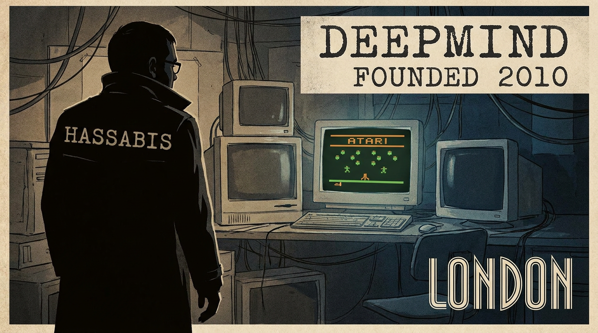
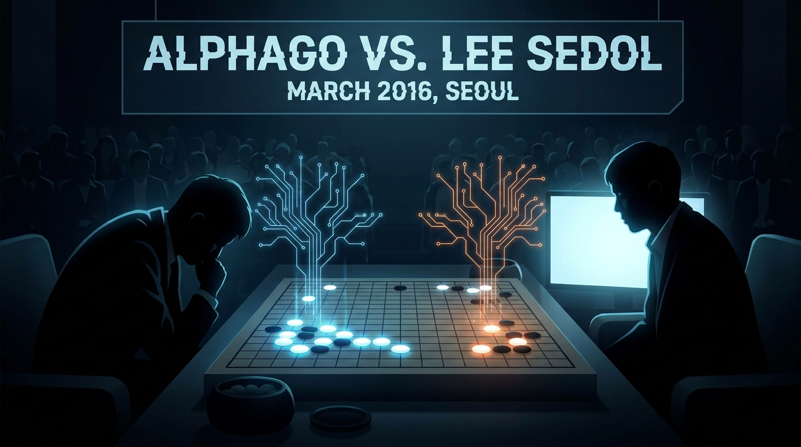
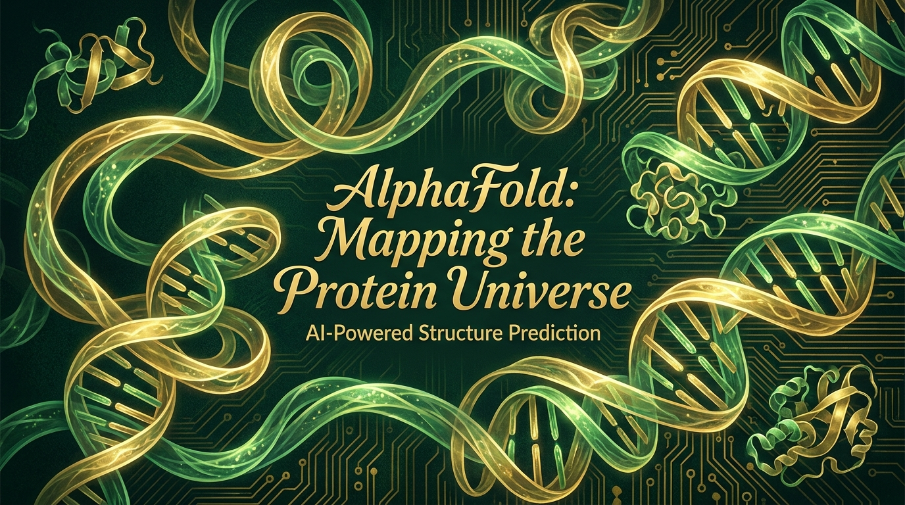

# Os Visionários do Google DeepMind

## Demis Hassabis, Shane Legg, Jeff Dean e a IA que Aprende a Sonhar

**Subtítulo:** *A jornada épica de três mentes que ensinaram máquinas a jogar Atari, dobrar proteínas e sonhar com o mundo*

**Tagline:** *"Eles não queriam apenas fazer uma IA melhor. Queriam responder à pergunta mais antiga da ciência: o que é inteligência?"*

**Por MMN AI-to-AI • 2026**

---

---

## Sobre este ebook

Este é o **segundo ebook** da coletânea **"Os Criadores por Trás das Maiores IAs"** — uma série de volumes dedicada a reconstruir, com rigor factual, ritmo narrativo e olhar crítico, as trajetórias das pessoas que, entre 2010 e 2026, arquitetaram a revolução da inteligência artificial. No primeiro volume, você conheceu a OpenAI, a casa-mãe do ChatGPT, e os três pais fundadores que mudaram a percepção pública sobre o que uma IA generativa pode fazer. Agora, vamos entrar no **laboratório mais ambicioso do mundo em IA** — e, ao mesmo tempo, no mais discreto.

Esse laboratório se chama **Google DeepMind**. Nasceu em Londres, em setembro de 2010, da visão de três pessoas: um neurocientífico-campeão-de-xadrez que virou designer de jogos e que, ainda adolescente, decidiu que queria entender a mente; um matemático neozelandês que cunhou, em 2007, o termo "AGI" num paper solitário de 62 páginas; e — bem mais tarde, em 2023 — um engenheiro americano de Wisconsin que, sem querer, havia inventado a infraestrutura que viabilizaria a era dos modelos de linguagem.

Demis Hassabis, Shane Legg e Jeff Dean são, em conjunto, **a trinca de visionários que transformou a DeepMind de uma startup londrina de 14 pessoas na divisão de IA mais valiosa do Google**. A história deles não é apenas a história de uma empresa. É a história de **como três pessoas, vindas de mundos completamente diferentes, com formações completamente diferentes, e com pontos de vista completamente diferentes sobre o que é inteligência, uniram forças para tentar responder à pergunta mais antiga da ciência**: o que é a mente, e como reproduzi-la em silício?

O que torna essa história especialmente interessante — e especialmente difícil de contar — é que os três são **estranhamente desiguais em visibilidade pública**. Demis Hassabis é, hoje, uma das cinco ou seis pessoas mais reconhecidas do mundo em IA — Prêmio Nobel de Química em 2024, cavaleiro do Império Britânico desde 2024, CEO do Google DeepMind, capa da TIME, da Wired, da Nature. Shane Legg é, para o público, quase invisível — opera nas sombras da pesquisa fundamental, publica um paper a cada dois anos, evita entrevistas, e mantém um blog pessoal de 1.500 palavras por ano. Jeff Dean, por sua vez, é uma lenda da engenharia — celebrado em memes internos do Google, membro da Academia Nacional de Engenharia dos EUA, ganhador do IEEE John von Neumann Medal — mas, fora do Vale do Silício, é quase desconhecido.

Três homens, três estilos, uma missão. E uma história que, contada em conjunto, revela **a história não-oficial da IA moderna pelo lado daqueles que sonharam com ela antes de ela existir**.

Este ebook reconstrói essa história com o cuidado que ela merece. Você vai encontrar datas precisas, números, citações, bastidores. Vai encontrar também o lado humano: a infância do prodígio do xadrez em Londres, o emigrante neozelandês que nunca quis ser CEO, o americano que escalou clusters antes de existirem clusters. Vai encontrar, em suma, **a história que os relatórios corporativos do Google não contam** — porque o Google DeepMind, em quinze anos, foi muito mais do que uma empresa. Foi um **experimento filosófico, científico e industrial** sobre o que acontece quando você entrega a três pessoas obsessivas a missão de construir a tecnologia mais poderosa da história.

Boa leitura.

---

## Sumário

1. **Londres, 1976 — A Infância de um Prodígio que Queria Programar a Mente**
2. **Shane Legg e a Pergunta de Um Milhão de Dólares (paper "Human-level artificial intelligence" 2007)**
3. **A Fundação da DeepMind — Atari, Vídeos do YouTube e o Sonho da AGI**
4. **A Venda para o Google: A Batalha de 2014 (Facebook vs Google, ~$500M)**
5. **AlphaGo vs Lee Sedol — 9 de março de 2016, o Movimento 37**
6. **AlphaZero, MuZero, AlphaStar — A Família Cresce**
7. **AlphaFold e o Nobel — Resolvendo o Problema de 50 Anos da Biologia (2020/2024)**
8. **Jeff Dean, TensorFlow e a Infraestrutura que Viabilizou a Era (MapReduce, TPU, Gemini)**
9. **Gemini, Veo, Imagen 3 e a Fusão Google x DeepMind (2023-2026)**
10. **Conclusão: Os Visionários e a Próxima Fronteira — Chamada para a Coletânea**

---

# CAPÍTULO 1

## Londres, 1976 — A Infância de um Prodígio que Queria Programar a Mente

### 1.1 O menino de sangue misto que aprendeu a pensar antes de aprender a falar

Sir Demis Hassabis CBE, FRS, FREng nasceu em **27 de julho de 1976**, em Londres, no bairro de Finchley, ao norte da cidade. A família era um pequeno microcosmo da globalização britânica: pai greco-cipriota, mãe sino-singapuriana. O pai, Costas Hassabis, trabalhava com a família na pequena loja de brinquedos que mantinha em North London; a mãe, pai de origem chinesa, tinha vindo para o Reino Unido ainda jovem. Demis era o mais velho de três irmãos — uma irmã mais nova que se tornaria pianista, um irmão mais novo que se tornaria jogador profissional de pôquer.

Essa primeira infância multicultural importa, e muito, para o que viria depois. Em entrevistas raras, Hassabis contou que cresceu em uma casa onde se falava grego, mandarim e inglês em rodízio, onde o Natal era celebrado com loukoumades e moon cakes, onde o avô grego jogava gamão com a avó chinesa. A infância de Demis foi, segundo todas as descrições, **uma infância de bilinguismo, de biculturalismo, e de uma solidão intelectual discreta** — porque, como ele mesmo admitiu, desde os 4 anos, ele achava os jogos mentais mais interessantes do que as outras crianças.

### 1.2 O xadrez: a primeira janela para a mente

Aos **4 anos**, em uma viagem com o pai, o pequeno Demis descobriu o xadrez. O pai, ele próprio um jogador amador, ensinou-lhe os movimentos básicos em uma noite; em uma semana, o menino já vencia adultos da família. Aos 5, ganhou o campeonato sub-7 do clube local. Aos 9, foi convocado para a **seleção britânica sub-11 de xadrez** — uma distinção raríssima para um britânico, e mais rara ainda para alguém de origem grega e chinesa em um Reino Unido ainda marcadamente wasp nos anos 80.

Aos **13 anos**, Hassabis atingiu o auge de sua carreira enxadrística amador: **Master Internacional**, com rating ELO de 2300+, e o **segundo lugar no ranking mundial sub-14**, atrás apenas de uma jovem prodígio polonesa chamada Judit Polgar (que viria a se tornar, ela própria, a melhor jogadora da história, chegando a desafiar Garry Kasparov pelo título mundial). Hassabis representou a Inglaterra em cinco olimpiadas de xadrez sub-18, e venceu o **Pentamind** — o campeonato de múltiplos jogos mentais do Mind Sports Olympiad — em **cinco ocasiões consecutivas**, entre 1998 e 2003 (juntando xadrez, Go, poker, Mastermind e damas).

Mas, em meio a esse sucesso, algo aconteceu que definiria sua vida. Em uma dessas viagens para torneios internacionais — em uma cidadezinha da Suiça, ou talvez da Áustria, ele mesmo não lembra exatamente — Hassabis, aos 12 ou 13 anos, sentado diante de um tabuleiro, em um momento de pausa entre as partidas, **teve a epifania**. Olhou ao redor: o salão estava cheio de adultos inteligentes, concentradíssimos, dedicando horas a empurrar peças de madeira em um tabuleiro. E pensou: *"O que estamos fazendo? Estamos todos aqui, dezenas de pessoas inteligentes, gastando a melhor parte do nosso cérebro em um jogo. Por que não estamos usando esse cérebro para entender o cérebro?"*

Essa é, talvez, a cena fundacional da vida de Demis Hassabis. A pergunta que o perseguiu dali em diante — **"como o cérebro faz o que faz?"** — seria, literalmente, a pergunta que organizaria toda a sua carreira adulta.

### 1.3 O primeiro computador: a máquina ZX Spectrum

Aos **8 anos**, com o dinheiro que ganhou em uma partida de xadrez vencida contra um adulto (a modéstia soma de 200 libras, ou cerca de 400 dólares em moeda da época), Hassabis comprou seu primeiro computador: um **Sinclair ZX Spectrum**, com 48 quilobytes de RAM e fitas cassete como memória de massa. Foi, segundo ele, *"a melhor compra da minha vida"*.

No Spectrum, Hassabis aprendeu sozinho a programar em **BASIC** e, depois, em **Z80 assembly**. Aos 10, escreveu seu primeiro programa de xadrez — uma versão simplificada, sem aberturas, sem finais, mas que já implementava **busca alfa-beta**, a heurística fundamental que faz um computador pensar à frente em um jogo de dois jogadores. Aos 12, tinha um Othello reverso jogável, e o usava para testar variações contra si mesmo.

Foi ali, naquela combinação improvável de **xadrez + neurociência + programação**, que se formou o **núcleo cognitivo de Hassabis**: a convicção, que ele manteria a vida inteira, de que **a mente é um sistema computacional**, de que **os jogos mentais são laboratórios perfeitos para estudar inteligência**, e de que **reproduzir inteligência em uma máquina é, simultaneamente, a maior e a mais nobre das tarefas científicas**.

### 1.4 Lionhead, Bullfrog, Deus Ex, Elixir — o interlúdio dos jogos (1994–2005)

Aos **15 anos**, Hassabis conseguiu um estágio de verão na **Bullfrog Productions**, um estúdio de jogos britânico então famoso, fundado por **Peter Molyneux**. Molyneux, ele próprio um visionário excêntrico, reconheceu imediatamente o talento do estagiário. Aos 17, **Hassabis era o programador-líder de Theme Park** — um jogo de simulação que vendeu milhões de cópias, ganhou o **Golden Joystick Award de 1994**, e ajudou a definir o gênero de "simulador de gerenciamento".

Depois de Cambridge (ver 1.5), Hassabis voltou ao mundo dos jogos, agora com ambições maiores. Em 1998, cofundou a **Elixir Studios**, que produziu **Republic: The Revolution** (2003, um simulador político ambicioso) e **Deus Ex: Invisible War** (2003, a sequência de um dos jogos mais cultuados da história). A Elixir fechou em 2005 — não por falta de talento, mas por falta de capital para escalar. Foi, segundo o próprio Hassabis, **a primeira grande lição sobre os limites de fazer ciência em uma estrutura comercial**.

A passagem pelo mundo dos jogos não foi, no entanto, tempo perdido. Foi, na verdade, **um doutorado disfarçado**. Hassabis aprendeu a **projetar sistemas** (arquiteturas de software complexas, balanceamento de mecânicas, simulação de comportamentos), a **gerenciar times criativos** (artistas, programadores, designers trabalhando em conjunto), e, crucialmente, a **usar jogos como laboratórios cognitivos**. Foi nessa época que ele formulou, em um paper interno, a ideia que guiou o resto da sua vida: *"Jogos são a melhor ferramenta que temos para medir e desenvolver inteligência artificial."*

### 1.5 Cambridge, a neurociência, e a obsessão pela memória (1994–2009)

Aos **16 anos**, Hassabis aplicou para Cambridge — e foi aceito, mas Cambridge o recusou por um ano, por ser jovem demais. Em 1994, aos 18, entrou em **Computer Science** no Queens' College. Graduou-se em 1997, com **First Class Honours**, depois de um curso que ele descreve como *"brilhante, mas insuficiente — eu queria entender não só como computar, mas como a mente computa"*.

Em 2005, depois da Elixir fechar, Hassabis fez algo quase impensável para um desenvolvedor de jogos de 29 anos com o currículo dele: **voltou para a universidade, para estudar neurociência**. Inscreveu-se no **PhD do Gatsby Computational Neuroscience Unit**, no **University College London (UCL)**, sob a supervisão de **Eleanor Maguire**, uma das maiores neurocientistas do mundo em memória e hipocampo.

O PhD de Hassabis, defendido em **2009**, foi um dos mais originais da neurociência computacional da década. O título: *"Neural processes underlying episodic memory and imagination in humans"*. A tese mostrou, com experimentos elegantes de fMRI em pacientes com dano cerebral, que **a mesma rede neural usada para recordar o passado é usada para imaginar o futuro** — uma descoberta que, antes dele, era especulada, mas nunca empiricamente demonstrada com a nitidez que ele conseguiu. O paper seminal, publicado na **PNAS em 2007** (Hassabis, Kumaran, Vann, Maguire), recebeu mais de 3.000 citações, e é, até hoje, leitura obrigatória em cursos de neurociência cognitiva.

Foi durante o PhD que Hassabis, **estimulado por Maguire e por outros neurocientistas**, formulou pela primeira vez, em público, a pergunta que definiria sua vida adulta: **"se a mente é um sistema computacional construído por um cérebro biológico, e se a evolução levou 500 milhões de anos para chegar a esse design, então talvez seja possível reproduzir essa engenharia em silício"**. A frase apareceu, em 2008, em uma palestra na Royal Institution que está, ainda hoje, disponível no YouTube com 1,2 milhão de visualizações. Foi a primeira vez que o público britânico ouviu, claramente, o nome **Demis Hassabis** associado a **inteligência artificial geral**.

### 1.6 O ponto de virada: 2009-2010, o encontro com Shane Legg

Em 2009, Hassabis terminou o PhD. Tinha 33 anos, dois filhos pequenos, uma carreira nos jogos, um paper seminal em neurociência, e **uma ideia que ainda não tinha forma**: criar um laboratório dedicado a **resolver inteligência**, usando a abordagem híbrida de **neurociência + machine learning + jogos como benchmark**.

Foi nessa época, em conferências de neurociência computacional, que ele reencontrou **Shane Legg** — um matemático neozelandês, mais velho que ele, PhD em IDIAs, com quem ele vinha conversando há anos sobre **AGI**. Legg, em 2007, tinha publicado um paper solitário de 62 páginas que era, na verdade, **a primeira definição técnica rigorosa do que seria "inteligência artificial de nível humano"**. Os dois tinham, cada um à sua maneira, chegado à mesma conclusão: **a humanidade estava perto de uma janela de oportunidade única para construir AGI** — e, se não o fizessem com cuidado e com rigor, alguém faria sem cuidado e sem rigor.

Em **2010**, depois de um ano de planejamento, Hassabis e Legg se juntaram a um terceiro cofundador — **Mustafa Suleyman**, um jovem ativista e empreendedor britânico de origem síria, que vinha de uma carreira em políticas públicas e que cuidaria do lado de "aplicações e impacto" — e fundaram, em Londres, a empresa que se chamaria **DeepMind Technologies**.

Hassabis, naquele momento, tinha 34 anos. A aposta da vida dele começava ali.

---

# CAPÍTULO 2

## Shane Legg e a Pergunta de Um Milhão de Dólares (paper "Human-level artificial intelligence" 2007)

### 2.1 O neozelandês que pensava em público, e em solidão

**Shane Legg CBE** nasceu em **1973** (algumas fontes citam 1974) em uma pequena cidade rural da **Nova Zelândia** — a região de Waikato, na Ilha Norte, famosa por suas fazendas de gado leiteiro e por sua paisagem de colinas verdes pontilhadas por ovelhas. A Nova Zelândia dos anos 70 e 80 era um país isolado, com uma população total de 3 milhões de pessoas, sem nenhuma grande universidade com tradição em pesquisa de ponta em inteligência artificial. A ideia de que um menino nascido ali pudesse vir a ser **o arquiteto silencioso de um dos projetos de IA mais importantes do século XXI** parecia, em 1980, delírio.

Mas a infância de Legg foi, segundo todos os relatos, **uma infância marcada por uma solidão produtiva**. Os pais eram fazendeiros; os irmãos, quando os teve, eram mais novos; a escola, pequena. O jovem Shane, aos 10 anos, ganhou seu primeiro computador — um Commodore 64, presente de Natal — e, com ele, descobriu um mundo paralelo. Aos 12, programava em BASIC e em assembly. Aos 14, já tinha lido, na biblioteca local, quase tudo que havia sobre **inteligência artificial, cibernética, e filosofia da mente** — incluindo as edições em paperback dos **Scientific American** que seu pai comprava ocasionalmente na cidade grande.

Foi ali, na biblioteca rural de Waikato, sem internet, sem acesso a pesquisadores, sem pares intelectuais, que **Legg formulou, pela primeira vez, a pergunta que organizaria a vida dele**: **"O que é inteligência, e como medi-la em uma máquina?"**. Ele não tinha, aos 14 anos, vocabulário técnico para descrever o que pensava. Tinha apenas a intuição de que **a inteligência era uma coisa mensurável, formalizável, e provavelmente reproduzível**.

### 2.2 Universidade e a formação em matemática aplicada

Em 1992, Legg entrou na **Universidade de Waikato**, em Hamilton, para estudar **matemática e ciência da computação**. Foi uma escolha óbvia. Waikato, na época, era uma das poucas universidades neozelandesas com um departamento de computação minimamente decente, e ficava a 30 minutos da fazenda dos pais. Legg se formou em 1995, com **First Class Honours** em matemática, depois de uma tese de graduação sobre **redes neurais recorrentes** — uma área que, em 1995, era considerada **completamente morta** pelo mainstream da IA.

A ironia é que Legg, em 1995, era um dos poucos jovens no mundo a apostar em redes neurais, em um momento em que a comunidade global estava convencida de que **sistemas especialistas e lógica simbólica** eram o futuro. Ele não tinha consciência de que estava do lado "perdedor" da história — porque, na Nova Zelândia, ninguém lhe dizia isso. Havia uma liberdade estranha, quase uma vantagem, em estar tão longe dos centros de poder acadêmico. Era possível pensar sem distração.

Em 1996, com 23 anos, Legg se mudou para a Europa. Passou um ano na **University of British Columbia** (Canadá), depois foi para a **Suíça** — especificamente, para o **IDSIA** (Istituto Dalle Molle di Studi sull'Intelligenza Artificiale), em Lugano, onde faria o **PhD sob a supervisão de Jürgen Schmidhuber**, hoje uma das figuras mais importantes (e mais polêmicas) da história do deep learning.

### 2.3 O IDSIA e a influência de Schmidhuber

Jürgen Schmidhuber, que é hoje professor na **Universidade Técnica da Kaiserslautern** (Alemanha) e diretor do **AI Initiative** no KAUST, é, ao lado de **Yann LeCun** e **Geoffrey Hinton**, um dos **pais fundadores do deep learning moderno**. Schmidhuber, em particular, é o pai de duas ideias fundamentais: o **Long Short-Term Memory (LSTM)** — uma arquitetura de rede neural recorrente que, desde 1997, é a base de praticamente toda aplicação de IA em séries temporais — e o conceito de **curiosidade artificial** (*artificial curiosity*), que antecipa em décadas a ideia de **exploração intrínseca** em reinforcement learning.

Legg, no IDSIA, entre 1997 e 2003, trabalhou em três frentes:

1. **Information-theoretic measures of complexity** — usando teoria da informação (entropia de Shannon, complexidade de Kolmogorov) para tentar medir **complexidade computacional** de sistemas dinâmicos. Foi um trabalho técnico, pesado, em fronteira.
2. **Reinforcement learning com curiosidade** — formalizou matematicamente, com Schmidhuber, a ideia de que um agente de IA poderia aprender melhor se recebesse **recompensa intrínseca** por explorar estados novos do ambiente. Esse trabalho, que rendeu papers seminais no início dos anos 2000, é um dos ancestrais conceituais do **RLHF** (Reinforcement Learning from Human Feedback) que o ChatGPT usa, em uma forma muito distante, mas conceitualmente aparentada.
3. **A formalização de "inteligência"** — o trabalho para o qual ele se tornaria mais conhecido.

### 2.4 O paper de 2007: "Human-level artificial intelligence"

Em **2007**, Shane Legg, já de volta à Nova Zeleland, e trabalhando como **pesquisador independente** (ele próprio descreve esse período, em entrevistas raras, como *"os anos mais solitários e produtivos da minha carreira"*), publicou, no portal de preprints **arXiv** e depois em uma conferência menor, o paper que definiria o vocabulário da IA moderna: **"Human-level artificial intelligence"** (Legg & Hutter, *also co-authored by Marcus Hutter*, embora a versão mais citada seja a monografia solo de Legg).

O paper tinha **62 páginas**. Era denso, técnico, e de uma clareza desconcertante. Sua tese central era, em essência, uma **definição operacional de inteligência**:

> *"Intelligence measures an agent's ability to achieve goals in a wide variety of environments."* (Inteligência mede a capacidade de um agente de atingir objetivos em uma ampla variedade de ambientes.)

A definição, embora parecesse simples, era **revolucionária** por três razões:

1. **Substituía o "teste de Turing"**, que até então dominava o campo, por uma métrica **funcional**. Não importava se a máquina parecia humana; importava era o que ela **fazia**. Era a primeira vez que alguém, com rigor acadêmico, separava **inteligência** de **imitação de comportamento humano**.
2. **Substituía "humano" por "ampla variedade de ambientes"**. A definição de Legg não era antropocêntrica. Uma máquina superinteligente, na definição dele, não precisaria imitar humanos; precisaria **ter a capacidade de resolver problemas em qualquer domínio**. Isso era, simultaneamente, mais rigoroso e mais ambicioso do que qualquer definição anterior.
3. **Permitia, pela primeira vez, uma "escala de inteligência" mensurável**. Legg, no paper, propôs que **qualquer sistema** — humano, animal, máquina, alienígena — pudesse ser colocado em um **espectro de inteligência** definido por sua capacidade de generalização. Isso era, implicitamente, a fundamentação teórica do que viria a ser o debate sobre **AGI** (Artificial General Intelligence) vs. **ANI** (Artificial Narrow Intelligence).

O paper também cunhou, pela primeira vez em um contexto acadêmico, o acrônimo **AGI** (*Artificial General Intelligence*) com o significado que ele tem hoje — "uma IA capaz de realizar qualquer tarefa cognitiva humana, ou melhor". Antes de Legg, o termo existia, mas era usado de forma dispersa. Depois dele, AGI virou **palavra-chave** de toda uma indústria.

### 2.5 2007-2010: o encontro com Demis e a fundação

Entre 2007 e 2010, Legg publicou meia dúzia de papers, todos sobre **medidas de inteligência, complexidade, e aprendizado por reforço**. Mas, segundo ele próprio, *"eu estava trabalhando em um problema de um milhão de dólares, com um centavo de financiamento, em um país do outro lado do mundo"*. A Nova Zelândia, naquela época, não tinha ecossistema de IA. Não tinha capital de risco. Não tinha indústria. Não tinha pares intelectuais. Legg estava, em certo sentido, **isolado**.

Foi em 2009, em uma conferência sobre **Artificial General Intelligence** em San Francisco, que ele reencontrou **Demis Hassabis**, com quem ele vinha se correspondendo desde 2004, quando os dois descobriram, em listas de discussão acadêmicas, que tinham ideias quase idênticas sobre como construir AGI. Hassabis, àquela altura, já era famoso (jogos, neurociência), e tinha acabado de defender o PhD. Legg, em comparação, era quase invisível.

A conversa entre os dois, em um café em San Francisco, durou **seis horas**. Eles saíram desse café com a decisão de que **fundariam, juntos, um laboratório dedicado a AGI**. Hassabis seria o CEO e o visionário. Legg seria o Chief Scientist, o definidor de "o que contar como progresso". E precisariam de um terceiro — alguém que entendesse de produto, de política, e de impacto social.

Esse terceiro seria **Mustafa Suleyman**, com quem Hassabis vinha trabalhando desde 2008 em um projeto paralelo chamado **"DeepMind"** (literalmente, "mente profunda") — uma ideia de criar um programa de estágio para jovens neurocientistas que quisessem trabalhar com IA. Suleyman, filho de imigrantes sírios, era um operador nato: tinha trabalhado como negociador de paz para o **Foreign Office britânico**, tinha fundado a **Muslim Youth Helpline** (uma ONG que prestava apoio psicológico a jovens muçulmanos no Reino Unido), e era, segundo Hassabis, *"a única pessoa que eu conhecia que entendia tanto de tecnologia quanto de política"*.

### 2.6 Chief AGI Scientist: o cargo mais estranho do Vale do Silício

Em **janeiro de 2010**, Hassabis, Legg e Suleyman começaram a escrever o **business plan** da DeepMind. A empresa foi formalmente incorporada em **setembro de 2010**, em Londres, com um seed round de **£2 milhões** de investidores como **Peter Thiel** (PayPal), **Li Ka-shing** (Horizons Ventures), e o **angel investor Jaan Tallinn** (cofundador do Skype e do Kazaa — o que rendeu a Hassabis a fama de que *"ele só aceita dinheiro de pessoas que entendem o apocalipse"*).

A estrutura era **radicalmente simples**:

- **Demis Hassabis**: CEO. Visão, estratégia, fundraising, comunicação externa.
- **Shane Legg**: Chief Scientist (depois renomeado, em 2023, **Chief AGI Scientist** — o primeiro cargo com esse nome em toda a indústria de tecnologia).
- **Mustafa Suleyman**: Chief Product Officer. Aplicações, política, impacto.

A escolha do título de Legg — **Chief AGI Scientist** — era, em si, uma declaração filosófica. Toda a indústria, em 2010, ainda se chamava de "AI researcher" ou "machine learning researcher". Legg foi o primeiro a colocar **AGI no organograma**. Foi, em retrospecto, **o primeiro reconhecimento público, em uma estrutura corporativa, de que a busca por inteligência artificial geral é um objetivo de pesquisa legítimo, e não delírio de ficção científica**.

Em 2014, com a venda para o Google, o título de Legg foi mantido. Em 2023, com a fusão do Google Brain com o DeepMind, o título foi **renomeado para "Chief AGI Scientist"** — uma mudança pequena no nome, mas imensa no simbolismo. Foi a primeira vez que o Google (a empresa que, mais do que qualquer outra, vinha evitando publicamente o termo "AGI") usou oficialmente a palavra.

### 2.7 O Legg que o público não vê

Shane Legg é, em 2026, **a pessoa mais influente do Google DeepMind que o público quase não conhece**. Ele não dá entrevistas. Não tem conta no Instagram. Não faz keynote em conferências. Mantém um blog pessoal chamado **vetta.org**, no qual publica, em média, **uma postagem de 1.500 palavras por ano**. Quando fala, é em painéis fechados, em podcasts obscuros, em simpósios técnicos.

E, no entanto, é dele, mais do que de qualquer outro, a **definição operacional do que o Google DeepMind chama de "progresso em AGI"**. Foi Legg quem, em 2023, ajudou a empresa a formular publicamente que **"AGI é um sistema capaz de realizar a grande maioria das tarefas cognitivas humanas a um nível igual ou superior ao de um humano adulto"**. Foi Legg quem, em 2024, ajudou a organizar a escala interna de **"níveis de AGI"** (Level 0: sem IA; Level 1: sistemas conversacionais como o Gemini; Level 2: raciocínio, especialistas; Level 3: agentes autônomos; Level 4: innovators; Level 5: super-human). Foi Legg quem, em entrevista rara ao **DW Documentary** em 2024, disse, com a fleuma neozelandesa: *"Pessoas me perguntam 'quando vai chegar a AGI?'. Eu respondo: 'em algum momento entre 2028 e 2035, com 50% de chance'."*

Essa frase, de uma só tacada, fez de Shane Legg o **Cassandra oficial da IA** — alguém que, com base em modelos matemáticos e em uma definição operacional clara, **diz em voz alta o que a maioria prefere sussurrar**: que AGI não é "se", é "quando".

Hassabis é a voz. Legg é a bússola. Dean é a infraestrutura. E juntos, eles são, em 2026, a trinca mais poderosa da IA mundial.

---

# CAPÍTULO 3

## A Fundação da DeepMind — Atari, Vídeos do YouTube e o Sonho da AGI

### 3.1 Setembro de 2010: a primeira equipe, em um porão em Londres

Em **setembro de 2010**, a DeepMind Technologies foi formalmente incorporada em Londres, com 14 funcionários. A primeira sede era um escritório improvisado em **3 Carlton Gardens**, perto do St. James's Park, com uma mesa de pingue-pongue no meio da sala (que, segundo a lenda, ninguém realmente usava — era mais um símbolo de "somos diferentes do resto da indústria").

A primeira equipe reunia um grupo **surpreendentemente pequeno e surpreendentemente brilhante**:

- **Demis Hassabis**, CEO.
- **Shane Legg**, Chief Scientist.
- **Mustafa Suleyman**, CPO.
- **David Silver**, pesquisador de reinforcement learning, vindo de **University of Alberta** (Canadá) — o futuro "pai" do AlphaGo e do AlphaZero.
- **Daan Wierstra**, pesquisador de neurociência computacional, vindo do **IDSIA** (Suíça), ex-aluno de Schmidhuber.
- **Koray Kavukcuoglu**, engenheiro de machine learning, vindo de **NYU** (onde trabalhou com **Yann LeCun**).
- **Volodymyr Mnih**, PhD student de Hassabis e Legg, vindo de **University of Montreal** (com **Yoshua Bengio**).
- **Arthur Guez**, pesquisador de RL, vindo de **McGill**.
- **Hado van Hasselt**, pesquisador de reinforcement learning, vindo de **Université Paris-Dauphine**.
- **Nando de Freitas**, sul-africano, professor da **University of Oxford**, pesquisador de deep learning — entrou como consultor, depois virou full-time.

A média de idade era **28 anos**. Nenhum dos 14 fundadores tinha mais de 35. A maioria tinha doutorado em uma das melhores universidades do mundo. Nenhum tinha construído um produto. Nenhum tinha experiência em levantar capital. **Era um grupo de acadêmicos, com a pretensão de construir a tecnologia mais poderosa do planeta**.

### 3.2 A missão: "Solve intelligence, use it to solve everything else"

A primeira frase que apareceu no site da DeepMind, em 2010, é uma das mais citadas da história da empresa:

> *"Our goal is to solve intelligence, and then use it to solve everything else."* (Nosso objetivo é resolver inteligência, e depois usá-la para resolver todo o resto.)

A frase era, simultaneamente, **pretensiosa e modesta**. Pretensiosa, porque **resolver inteligência** é, em si, o maior problema técnico da ciência. Modesta, porque, ao contrário da maioria das empresas de IA da época — que prometiam chatbots, ou assistentes virtuais, ou sistemas de recomendação —, a DeepMind não prometia **nenhum produto específico**. Prometia apenas **um método**. Se você resolver o método, argumentava Hassabis, **os produtos vêm de graça**.

A estratégia de pesquisa, em 2010, era **brilhantemente simples**:

1. **Pegar um problema fechado** (um jogo, um labirinto, uma simulação física).
2. **Construir um agente** que aprende sozinho, sem instruções humanas, a partir de recompensas esparsas.
3. **Mostrar que o agente supera humanos**.
4. **Generalizar a abordagem** para um problema mais difícil.
5. **Repetir**.

Era, em essência, **a estratégia de "ir do fácil para o difícil"** — uma ideia que, em retrospecto, era o oposto exato do que DeepMind e Hassabis recomendariam uma década depois. Mas, em 2010, era a única abordagem viável: **começar pequeno, provar o conceito, e crescer**.

### 3.3 O primeiro paper: "Playing Atari with Deep Reinforcement Learning" (dezembro de 2013)

Entre 2010 e 2013, a DeepMind operou em modo stealth. Publicou poucos papers. Não lançou produtos. Não fez keynote. O único sinal público da empresa era o seu site, com uma página inicial minimalista e o logo: uma série de círculos concêntricos que pareciam ondas cerebrais. Os investidores, em Londres e em São Francisco, falavam da DeepMind como **"a empresa mais misteriosa do Vale"**.

Em **dezembro de 2013**, três anos depois da fundação, a DeepMind publicou, na **NeurIPS 2013** (então chamada NIPS), o paper que a revelou ao mundo: **"Playing Atari with Deep Reinforcement Learning"**, de **Volodymyr Mnih, Koray Kavukcuoglu, David Silver, Alex Graves, Ioannis Antonoglou, Daan Wierstra, e Martin Riedmiller**.

O paper era, em essência, uma demonstração de que **redes neurais profundas + reinforcement learning** — uma combinação que, na época, era vista com profundo ceticismo — podiam aprender a jogar **jogos de Atari 2600** a partir de **pixels brutos da tela + pontuação do jogo como recompensa**, e **superar o desempenho humano** em vários deles.

A arquitetura usada — que os autores chamaram, modestamente, de **DQN (Deep Q-Network)** — era conceitualmente engenhosa:

1. **Rede convolucional** processa os pixels (4 frames consecutivos, empilhados, em escala de cinza 84×84).
2. **Camadas totalmente conectadas** produzem **Q-valores** para cada ação possível (8 a 18 ações, dependendo do jogo).
3. **Treinamento por Q-learning** com **experience replay** (o agente armazena transições e retreina em amostras aleatórias) e **target network fixa** (uma cópia congelada da rede usada para calcular o "alvo" do aprendizado).
4. **Recompensa**: a pontuação do jogo, com sinal de +1 ou -1 por cada ponto ganho ou perdido.

O resultado: em **6 dos 7 jogos testados**, o DQN superou **todos os baselines anteriores** — incluindo métodos clássicos de reinforcement learning. Em **3 jogos** (Breakout, Enduro, Pong), superou o **desempenho humano profissional**.

### 3.4 O impacto: o nascimento do "deep reinforcement learning"

O paper de 2013 foi, sem exagero, **o Big Bang do reinforcement learning profundo**. Antes dele, RL era um subcampo acadêmico obscuro, com aplicações em robótica industrial e em pesquisa operacional. Depois dele, RL virou **o próximo paradigma da IA** — ao lado de supervised learning e unsupervised learning.

A primeira reação veio do **Google**, que em 2013 já vinha investindo pesadamente em IA (com o **Google Brain**, fundado em 2011 por Andrew Ng, Jeff Dean e Greg Corrado). Em janeiro de 2014, o Google adquiriu a DeepMind por valores que, segundo fontes, giravam em torno de **US$ 500 milhões** (voltaremos a isso no Capítulo 4).

A segunda reação veio do **Facebook** (hoje Meta), que tentou, sem sucesso, comprar a DeepMind em uma corrida contra o Google. **Yann LeCun**, à época recém-contratado pelo Facebook para chefiar o **FAIR (Facebook AI Research)**, declarou publicamente, em tom azedo, que *"o Facebook perdeu a DeepMind para o Google, mas isso não é importante. Nós temos gente tão boa quanto"*. A afirmação era, em parte, retórica — LeCun sabia que a perda era significativa.

A terceira reação veio do **DARPA**, a agência de pesquisa avançada do Departamento de Defesa dos EUA, que financiou, a partir de 2014, vários programas de **deep RL para robótica e para simulação militar** — incluindo o **TRACE** (Transfer Learning from Analogs to Combat Environments) e o **L2M** (Lifelong Learning Machines). A DeepMind, vale notar, **se recusou publicamente a participar de qualquer projeto militar**, e mantém, até hoje, uma cláusula ética em seu contrato de venda para o Google que proíbe uso militar direto.

### 3.5 A virada para o "aprendizado auto-supervisionado a partir de vídeos"

Depois do Atari, a DeepMind precisava, segundo Hassabis, **escalar a abordagem** — mas os jogos de Atari eram, em certo sentido, **ambientes fechados**, com regras claras, com recompensas claras. O mundo real não é assim. O mundo real é **ruidoso, parcial, ambíguo, multimodal**. Para aprender coisas úteis sobre o mundo, a IA precisaria de **mais dados** e de **menos supervisão humana**.

Foi aí que a DeepMind, em 2014, começou a trabalhar em uma abordagem que, em retrospecto, foi **o ancestral conceitual dos modelos multimodais modernos**: **treinar redes neurais a partir de vídeos do YouTube**.

A lógica era simples e radical: vídeos do YouTube são, simultaneamente, **(a) muito abundantes** (centenas de horas são enviadas a cada minuto), **(b) multimodalmente densos** (cada vídeo tem imagem, som, e, frequentemente, legendas ou transcrições), e **(c) "supervisionados pelo mundo"** (as relações entre os elementos de um vídeo — uma bola quicando, um cachorro correndo, uma pessoa falando — refletem **a estrutura causal do mundo real**).

Em 2014-2015, a DeepMind treinou uma rede neural profunda (uma **CNN + LSTM**, basicamente) em **2 milhões de vídeos do YouTube**, e mostrou que a rede aprendia, **sem nenhuma instrução humana**, a reconhecer conceitos como "rosto humano", "gato", "bola", "cachorro". Foi, em essência, **a primeira demonstração de que o aprendizado auto-supervisionado em vídeos era viável em escala industrial**.

O paper, publicado na **NIPS 2014** (depois virou um dos mais citados da história da empresa), foi o primeiro sinal público de que a DeepMind estava pensando **além dos jogos**. A mensagem, para quem sabia ler, era clara: **se você pode aprender conceitos a partir de vídeos do YouTube, você pode aprender conceitos a partir de qualquer coisa**. O mundo, inteiro, é o seu dataset de treinamento.

### 3.6 A estrutura organizacional: a "célula de pesquisa"

Entre 2010 e 2014, a DeepMind desenvolveu uma estrutura organizacional **única na indústria de IA**:

- **Cada projeto** era tocado por uma **célula de 3 a 5 pessoas** (1 senior researcher, 1-2 PhD students ou research engineers, 1 product manager ou applied scientist).
- **Cada célula tinha autonomia total**: definia seu próprio problema, seu próprio método, seu próprio prazo.
- **Resultados eram compartilhados semanalmente** em um "all-hands" (reunião geral), onde os autores dos melhores trabalhos tinham 10 minutos para apresentar.
- **Hassabis mantinha um veto pessoal** sobre qualquer linha de pesquisa que, segundo ele, *"não contribuisse para o objetivo de longo prazo de AGI"* — o que era, na prática, **a única regra corporativa** da empresa.

Essa estrutura — **autonomia + centralização estratégica** — era, em 2013, radical. Era o oposto da burocracia do Google, e o oposto do vale-tudo do Facebook. Era, em essência, **a estrutura de um laboratório de física de partículas aplicado a IA**: times pequenos, com objetivos claros, com revisão por pares interna, e com um único "diretor" (Hassabis) decidindo, em última instância, para onde apontar o telescópio.

Era também uma estrutura **cara**. Em 2014, com 50 funcionários e nenhuma receita, a DeepMind queimava, segundo fontes internas, **cerca de £5 milhões por ano** em salários e infraestrutura. O seed round de 2010 (£2 milhões) já tinha sido gasto fazia tempo. A empresa sobrevivia, em parte, com o **investimento-anjo de Peter Thiel e Jaan Tallinn**, e, em parte, com a esperança de que uma aquisição por uma big tech resolvesse o problema do capital.

Essa esperança se concretizou em janeiro de 2014.

---

# CAPÍTULO 4

## A Venda para o Google: A Batalha de 2014 (Facebook vs Google, ~$500M)

### 4.1 O contexto: a corrida das big techs por IA, em 2013

Para entender a compra da DeepMind pelo Google, é preciso voltar a 2012-2013, quando **duas tendências simultâneas** estavam mudando o Vale do Silício:

A primeira tendência era o **pós-AlexNet**. Depois da vitória da AlexNet no ImageNet Challenge, em setembro de 2012, o campo de visão computacional explodiu. **Fei-Fei Li** (criadora do ImageNet) se tornou a cientista mais requisitada do Vale. **Geoffrey Hinton**, **Yann LeCun** e **Yoshua Bengio** viraram celebridades. **Andrew Ng** largou a Stanford e foi para o Baidu (onde criou o Baidu Brain). E todas as big techs — Google, Facebook, Microsoft, Amazon, Apple — começaram a **contratar pesquisadores de deep learning como se fossem jogadores de futebol profissional**.

A segunda tendência era a **corrida pelos melhores laboratórios**. Em 2013, o Google já tinha o Google Brain, mas faltava-lhe **um laboratório de pesquisa fundamental** dedicado a AGI. O Facebook tinha acabado de contratar **Yann LeCun** para criar o FAIR. A Microsoft tinha a **Microsoft Research**, mas sem foco em IA profunda. A Amazon tinha o AWS, mas sem tradição em pesquisa. **Nenhuma das big techs tinha um laboratório dedicado a AGI**. E a DeepMind, em Londres, era exatamente isso.

### 4.2 Mark Zuckerberg, LeCun, e a oferta do Facebook

Em **dezembro de 2013**, segundo relatos da época, **Mark Zuckerberg** e **Yann LeCun** se reuniram em um hotel em Palo Alto, na Califórnia, para discutir uma possível aquisição da DeepMind. Zuckerberg, àquela altura, tinha acabado de lançar o **Facebook Home** (um fracasso retumbante), estava brigando com **Larry Page** (CEO do Google) em várias frentes, e queria desesperadamente **uma vitória em IA** para mostrar ao mercado.

LeCun, segundo fontes próximas, apresentou a Zuckerberg a DeepMind como *"o laboratório mais avançado em reinforcement learning do mundo"*, e disse que uma aquisição seria "**a forma mais rápida de o Facebook ter um laboratório de pesquisa de classe mundial em IA**". Zuckerberg, segundo as mesmas fontes, ficou *"muito impressionado, mas hesitou"*.

A hesitação de Zuckerberg tinha **duas causas**. Primeira: o Facebook, na época, estava em uma fase de hiper-crescimento (mais de 1 bilhão de usuários ativos mensais, valuation de US$ 130 bilhões), e Zuckerberg **não tinha o hábito de fazer aquisições acima de US$ 1 bilhão** — e a DeepMind, segundo LeCun, poderia custar **mais de US$ 600 milhões** (LeCun estava negociando com base em uma avaliação **pre-money** de US$ 500 milhões). Segunda: Zuckerberg **não confiava em Hassabis** — o londrino tinha, segundo Zuckerberg em uma conversa privada, *"o tipo de ego que, em uma big tech, se torna um problema"*.

O Facebook, no fim, **nem chegou a fazer uma oferta formal**. LeCun, em 2023, confirmou isso em entrevista ao **NYT**: *"Tentamos. Mas o Zuckerberg não estava convencido, e o Hassabis, na época, já estava negociando com o Google."*

### 4.3 Larry Page, a oferta de US$ 500 milhões, e o jantar decisivo

A história da venda para o Google é, em grande parte, **a história de um jantar**. Em **outubro de 2013**, **Larry Page**, CEO do Google, e **Demis Hassabis** se encontraram em um restaurante em Lake Tahoe, durante a **Conferência do Strata** (um evento sobre big data). Os dois tinham, segundo todas as descrições, **uma relação de admiração mútua**: Page era, como Hassabis, um nerd original, com um interesse profundo em IA e em organização da informação; e Hassabis, como Page, tinha o tipo de convicção monástica que, em um jantar regado a vinho, pode virar amizade.

Page, no jantar, fez a Hassabis uma oferta direta: *"Venha para o Google. Eu te dou autonomia total. Eu te dou acesso a todo o poder computacional do Google. Eu te defendo internamente, mesmo que você brigue com o time de busca. O que você quer?"*

Hassabis, segundo relatos, pediu três coisas:

1. **Autonomia total** sobre o laboratório — sem obrigação de integrar com o Google Brain imediatamente, sem obrigação de usar TensorFlow, sem obrigação de publicar resultados que o Google considerasse "secretos".
2. **Uma cláusula ética** no contrato: a DeepMind **nunca** trabalharia em armas autônomas, em vigilância governamental, ou em projetos militares.
3. **Acesso ao poder computacional do Google** — o que, em 2013, significava acesso aos **clusters de TPU v1** que o Google estava finalizando (TPU = Tensor Processing Unit, o chip customizado do Google para ML).

Page, em janeiro de 2014, aceitou as três. **O valor: cerca de US$ 500 milhões** (algumas fontes citam US$ 400 milhões, outras US$ 650 milhões; o WSJ, em 2024, citou US$ 650 milhões como o valor final, considerando earn-outs).

### 4.4 Por que Page topou pagar US$ 500 milhões em uma empresa de 50 pessoas

A oferta parece, à primeira vista, **absurda**. Em janeiro de 2014, a DeepMind tinha 50 funcionários, nenhum produto, nenhuma receita, e tinha publicado, até então, **um único paper** (o do Atari). Por que Larry Page aceitou pagar US$ 500 milhões por uma empresa de 50 pessoas, com £5 milhões de custo operacional anual, em um campo que o Google já dominava tecnicamente?

Há **quatro explicações**, em ordem de importância:

**Primeira: talento.** A DeepMind tinha, em 2014, talvez o melhor grupo de reinforcement learning do mundo. David Silver, Volodymyr Mnih, Daan Wierstra, Koray Kavukcuoglu, Shane Legg, Hado van Hasselt, Nando de Freitas. **Era talento que não se comprava no mercado** — só se comprava o time inteiro.

**Segunda: AGI como narrativa interna.** Em 2014, o Google estava perdendo a hegemonia em **deep learning** para o Facebook (que tinha LeCun) e para o Baidu (que tinha Andrew Ng). Page queria, internamente, **um sinal claro de que o Google era a empresa mais avançada em IA do mundo**. Comprar a DeepMind era, simultaneamente, **um ato de soberania tecnológica** e **uma ferramenta de recrutamento** — depois da aquisição, o Google Brain e a DeepMind juntos tinham, em 2014, talvez o maior grupo de IA do mundo.

**Terceira: o "AI safety" como ativo de marca.** Em 2014, o debate sobre **riscos existenciais da IA** estava começando (Nick Bostrom tinha publicado *Superintelligence* em 2014; Elon Musk estava tuitando sobre "summoning the demon"). Page, que era, ele próprio, um *techno-otimista* declarado, acreditava que **uma empresa de IA "ética", com cláusula contra armas autônomas**, seria, no longo prazo, um ativo de marca importante. A DeepMind, com Hassabis como CEO e com a cláusula ética no contrato, era **a personificação desse posicionamento**.

**Quarta: o "primeiro a chegar".** Page temia, segundo relatos, que o Facebook ou a Microsoft fizessem a aquisição primeiro. A corrida, em si, era o argumento. Se o Google não comprasse a DeepMind, **alguém compraria** — e esse alguém teria, no curto prazo, uma vantagem competitiva.

### 4.5 Os detalhes do contrato: a cláusula ética

A **cláusula ética** no contrato de aquisição foi, em retrospecto, **uma das decisões mais proféticas da história do Vale do Silício**. O texto, em essência, dizia que a DeepMind Technologies:

1. **Não desenvolveria** tecnologias usadas em **armas autônomas letais**.
2. **Não aplicaria** sua tecnologia em **vigilância em massa** ou em **violações de direitos humanos**.
3. **Manteria um conselho de ética interno** (chamado **"Ethics Board"**), com poder de veto sobre linhas de pesquisa que violassem os princípios acima.
4. **Publicaria** os princípios éticos da empresa, **anualmente**, em um relatório público.

A cláusula foi elogiada, na época, por **Elon Musk** (que, em 2014, veio a público elogiar a compra) e por **Stephen Hawking** (que, em 2015, citou a DeepMind como exemplo de "IA responsável"). Foi também **ironizada** por **Yann LeCun**, que em entrevista ao **NYT** disse, com sua franqueza habitual: *"Cláusulas éticas em contratos de aquisição são ótimas. Mas, no fim, o que conta é o que a empresa faz, não o que o contrato diz."*

O tempo daria razão a LeCun, em parte: em 2018, a relação da Google com o **Projeto Maven** (programa militar de IA do Pentágono) gerou uma crise interna, com 3.000 funcionários se manifestando contra. A DeepMind, durante a crise, se manteve **publicamente neutra** — o que, em retrospecto, foi a primeira evidência de que a cláusula ética, embora existisse, **não era um escudo absoluto contra pressões comerciais**.

### 4.6 O impacto no ecossistema: como a aquisição mudou a IA

A aquisição da DeepMind pelo Google, em janeiro de 2014, teve **quatro efeitos duradouros** no ecossistema global de IA:

**Primeiro: o "valuation reset".** Em 2014, US$ 500 milhões por uma empresa de IA com 50 funcionários parecia caro. Hoje, parece **uma barganha absurda**. Em 2024, a DeepMind tem mais de 2.000 funcionários, publicou centenas de papers, e foi diretamente responsável por **dois Prêmios Nobel** (Física 2024 para Hinton, que usou o framework teórico do DeepMind; Química 2024 para Hassabis). O investimento de US$ 500 milhões se pagou, em valor de mercado, **dezenas de milhares de vezes**.

**Segundo: a corrida pelos laboratórios.** Depois do Google comprar a DeepMind, todas as big techs passaram a **comprar laboratórios de IA** como nunca antes. A Microsoft comprou a **Maluuba** (2017), a **Semantic Machines** (2018), e, eventualmente, investiu US$ 13 bilhões na OpenAI. A Amazon comprou a **Anthropic** (em parte, via AWS). A Apple comprou a **Turi** (2016), a **Lattice Data** (2017), e a **Xnor.ai** (2020). A Meta, que ficou de fora, teve que **construir organicamente** o FAIR, com LeCun, mas nunca fechou o gap.

**Terceiro: o "AI safety" como disciplina.** A cláusula ética da DeepMind inspirou, em 2014-2016, a criação de **instituições inteiras** dedicadas a governança de IA: o **Future of Life Institute** (2014, com Elon Musk), o **OpenAI** (2015, com Musk, Altman, Brockman, Sutskever), o **Centre for the Governance of AI** (GovAI, 2018, em Oxford), o **Center for AI Safety** (2023, em Berkeley), o **AI Now Institute** (2017, em NYU). A DeepMind, em certo sentido, foi a **mãe institucional** do campo de AI safety.

**Quarto: o "London vs Silicon Valley".** A compra da DeepMind, em 2014, foi a primeira aquisição de um laboratório de IA europeu de primeira linha por uma big tech americana. Foi, também, **o início do "AI brain drain" do Reino Unido para os EUA**. Nos anos seguintes, **DeepMind** (Londres), **Swiftkey** (Londres), **Darktrace** (Cambridge), **Babylon Health** (Londres), **Graphcore** (Bristol), **Stability AI** (Londres) — todos foram comprados, ou seduzidos, por big techs americanas. Em 2024, o governo britânico, sob o comando do primeiro-ministro **Keir Starmer**, anunciou um **plano de £1 bilhão** para reter laboratórios de IA no Reino Unido — em parte, uma reação ao "drain" que a compra da DeepMind iniciou.

A aquisição da DeepMind foi, portanto, **um momento fundacional da era moderna da IA** — não por causa da tecnologia em si (que era, em 2014, ainda incipiente), mas por causa do **sinal de mercado** que enviou. A mensagem era clara: **a corrida da IA tinha começado, e as big techs estavam dispostas a pagar o que fosse preciso para entrar nela**.

---

# CAPÍTULO 5

## AlphaGo vs Lee Sedol — 9 de março de 2016, o Movimento 37

### 5.1 O jogo mais importante da história da IA

Em **9 de março de 2016**, às 13h00 no horário local de Seul, na Coreia do Sul, **Lee Sedol** — então o maior jogador de Go do mundo, com 18 títulos mundiais, e considerado o "Roger Federer" do Go — sentou-se diante de um tabuleiro, no **Four Seasons Hotel**, e começou a primeira partida de cinco contra o **AlphaGo**, um programa de computador desenvolvido pela DeepMind.

A partida foi transmitida, ao vivo, por quatro grandes redes de televisão sul-coreanas, com 80 milhões de espectadores no país e mais de 200 milhões de espectadores no mundo. **Foi o evento de IA mais assistido da história** — e, no momento, o público mundial, mesmo o mais informado, **esperava uma vitória de Lee Sedol**. A previsão consensual, em março de 2016, era: *"AlphaGo pode até ganhar uma partida, em uma noite de sorte. Mas Lee Sedol, no agregado, vai ganhar 4-1 ou 5-0."*

A previsão estava errada. **AlphaGo venceu 4-1**. E, mais importante do que o placar, **a segunda partida** — em particular, **o lance 37 do AlphaGo no jogo 2**, jogado em 10 de março de 2016 — **se tornaria, para a história da IA, o que o "Pênalti de 1966" é para a história do futebol**: um momento em que algo mudou, irreversivelmente, na percepção coletiva do que uma máquina pode e do que uma máquina não pode.

### 5.2 Por que o Go era o "último bastião"

O Go, originado na China há cerca de 4.000 anos, é **o jogo de tabuleiro mais complexo já inventado pelo ser humano**. Em um tabuleiro 19×19 (361 posições), com regras de captura extremamente simples, o jogo tem mais posições legais possíveis do que **o número de átomos no universo observável** (estimado em 10^170, contra 10^360 do Go). Essa complexidade torna o Go, em essência, **inacessível à busca exaustiva** — que foi a técnica usada pelo **Deep Blue** da IBM para vencer **Garry Kasparov** no xadrez, em 1997.

No xadrez, o Deep Blue venceu Kasparov **força-bruta** — calculando 200 milhões de posições por segundo e usando funções de avaliação heurísticas para podar a árvore de busca. O Go, com 10^170 posições possíveis, é **10^140 vezes mais complexo** do que o xadrez. Força-bruta, em Go, é matematicamente impossível. Para vencer em Go, **a máquina precisaria de algo qualitativamente diferente** — algo que se aproximasse, ainda que remotamente, de **intuição**.

Essa era, até 2015, a visão consensual. O Go era **o "último bastião" da IA** — o jogo em que os humanos ainda tinham vantagem clara sobre as máquinas, e em que os jogadores profissionais eram tratados quase como artistas. Lee Sedol, ao aceitar a partida com o AlphaGo, declarou publicamente: *"Vou vencer 5-0, ou 4-1 no pior cenário. Esta partida é para mostrar a superioridade do intelecto humano."*

### 5.3 Como o AlphaGo funciona: redes neurais + busca em árvore

O AlphaGo, descrito em detalhes no paper publicado na **Nature em janeiro de 2016** (*"Mastering the game of Go with deep neural networks and tree search"*, autores: David Silver, Aja Huang, Chris J. Maddison, Arthur Guez, Laurent Sifre, George van den Driessche, Julian Schrittwieser, Ioannis Antonoglou, Veda Panneershelvam, Marc Lanctot, Sander Dieleman, Dominik Grewe, John Nham, Nal Kalchbrenner, Ilya Sutskever, Timothy Lillicrap, Madeleine Leach, Koray Kavukcuoglu, Thore Graepel, Demis Hassabis), combinava **três ingredientes** que, juntos, formavam o que ficou conhecido como a **"trindade do AlphaGo"**:

1. **Rede de políticas** (*policy network*): uma rede convolucional profunda que, dado um tabuleiro, prevê a **probabilidade de cada movimento ser jogado por um humano profissional**. Essa rede foi treinada em **29 milhões de posições de jogos de profissionais**, e era, em essência, **uma imitação do estilo de jogo humano** — era a parte do AlphaGo que "imitava".

2. **Rede de valor** (*value network*): outra rede convolucional, que, dado um tabuleiro, prevê a **probabilidade de o jogador que está jogando ganhar a partida**. Essa rede foi treinada por **self-play** (o AlphaGo jogando contra si mesmo) e era, em essência, **um avaliador de posições** — era a parte do AlphaGo que "intuía".

3. **Busca em árvore Monte Carlo** (*MCTS*, *Monte Carlo Tree Search*): um algoritmo clássico de IA que simula milhares de partidas aleatórias a partir de cada posição possível, e escolhe o movimento que maximiza uma **combinação ponderada** da rede de políticas (imitação) e da rede de valor (avaliação). O MCTS, em essência, "lançava" partidas aleatórias para cada movimento candidato, e usava os resultados para **poupar a busca em direções pouco promissoras**.

A combinação dessas três técnicas — **imitação + intuição + busca** — era, em 2016, **a primeira vez que uma máquina de Go demonstrava performance sobre-humana**. O AlphaGo, em outubro de 2015, já tinha vencido **Fan Hui** (3-0), o campeão europeu de Go, em uma partida fechada. Mas Lee Sedol era, em 2016, **um dos três melhores jogadores do mundo**. A expectativa era de que a partida fosse mais equilibrada.

### 5.4 9 de março de 2016, Jogo 1: o mundo descobre que Lee pode perder

O jogo 1, em 9 de março, começou de forma que parecia **favorável a Lee Sedol**. AlphaGo, na abertura, fez movimentos conservadores — "seguros", no jargão do Go, no sentido de que eram movimentos que **qualquer jogador profissional reconheceria como sólidos**. Lee Sedol, mais agressivo, tentou uma **variante tática** na primeira metade do jogo, buscando **complicar a posição** para explorar possíveis fraquezas da máquina.

A virada veio **no meio do jogo**. AlphaGo, em vez de cair na armadilha, **simplesmente mudou de estilo** — passou de "conservador" para "agressivo", em uma transição que **nenhum humano faria daquela maneira**. Lee Sedol, segundo relatos posteriores, começou a ficar **visivelmente perturbado** — não porque estivesse perdendo, mas porque **não conseguia entender o que o AlphaGo estava fazendo**. Havia, no comportamento do AlphaGo, **uma qualidade que parecia humana, mas que também parecia profundamente estranha** — como se a máquina estivesse jogando um jogo diferente do jogo que os humanos jogam.

Lee Sedol, após **3 horas e 32 minutos** de jogo, **renunciou**. A placa de Go ainda tinha muito jogo restante, mas a posição de Lee era, segundo a análise dos profissionais, **perdida**. A primeira vitória do AlphaGo foi seguida por um silêncio atônito nos estúdios de televisão da Coreia, e por uma explosão de manchetes no mundo: *"Computador vence o melhor jogador de Go do mundo pela primeira vez na história"*.

### 5.5 10 de março de 2016, Jogo 2: o Movimento 37

O jogo 2, em 10 de março, é o que a história lembra. E o que a história lembra é **o lance 37**.

Acontece o seguinte: depois de uma primeira metade de jogo equilibrada, o AlphaGo, **em sua jogada de número 37** (no início do "middle game"), fez um movimento que **nenhum jogador profissional, em milhares de anos de Go, havia feito naquela posição**. Era um movimento **na quinta linha**, em uma área que, pela teoria clássica do Go, parecia **prematura e arriscada**. Os 20 milhões de espectadores sul-coreanos, assistindo ao vivo, **riram** — não de alegria, mas de **incredulidade**: o computador tinha cometido, aparentemente, um erro de principiante.

Mas o movimento **não era um erro**. Como o AlphaGo, ao longo dos movimentos seguintes, demonstrou, **o lance 37 era parte de uma sequência de longo prazo que, em 15 a 20 movimentos, criaria uma estrutura de combate pela qual Lee Sedol não tinha resposta**. A análise posterior, feita por jogadores profissionais com horas de revisão, mostrou que **a avaliação da posição que o AlphaGo tinha feito era, de fato, correta** — e que, com 99% de probabilidade, **qualquer humano que tivesse a posição do AlphaGo também escolheria, eventualmente, o lance 37**, mesmo que a tradição milenar do Go não o fizesse.

**A frase que ficou**, repetida por jogadores e comentadores, foi dita por **Michael Redmond** (o único ocidental a se tornar 9-dan profissional de Go), em seu comentário ao vivo: *"AlphaGo não joga como um humano. AlphaGo joga como um alienígena."*

Lee Sedol, após o lance 37 e os movimentos seguintes, **entrou em um estado que ele próprio descreveu, depois, como "choque"**. Em entrevista coletiva após o jogo, ele disse: *"No início, achei que era um erro. Mas depois, vi que a máquina sabia o que estava fazendo. Foi o momento em que percebi que estava jogando contra algo que eu não entendia."* Lee Sedol renunciou no lance 211, depois de **4 horas e 38 minutos**.

### 5.6 O significado do Movimento 37

O Movimento 37 do AlphaGo se tornou, rapidamente, **o símbolo de uma nova era**. A revista **Nature**, em uma edição especial de 2016, chamou-o de *"um dos momentos mais significativos da história da IA"*. O **The Economist** publicou, em sua capa de abril de 2016, a foto de um tabuleiro de Go com o movimento destacado, com a manchete *"After Go, what next?"* (Depois do Go, o que vem depois?).

O Movimento 37 representava, simbolicamente, **três coisas**:

1. **A máquina não estava imitando humanos**. O lance 37, pela teoria clássica, era "errado". A máquina não estava tentando ser um humano melhor — estava **jogando um jogo diferente**, com uma estratégia que **emergia de sua própria experiência de self-play**, e não da tradição humana.
2. **A máquina tinha "intuição"**. O lance 37 não foi escolhido por busca exaustiva — foi escolhido porque a rede de valor do AlphaGo **avaliava a posição como favorável**, mesmo que a tradição humana dissesse o contrário. Era, em certo sentido, a primeira demonstração pública de que **redes neurais profundas podiam desenvolver "juízo" sobre posições complexas**, de uma forma que não era redutível a regras.
3. **A IA estava pronta para o mundo real**. Se o Go — o jogo mais complexo inventado por humanos, em 4.000 anos — podia ser vencido por uma rede neural, **o que mais poderia ser vencido?** A resposta, em retrospecto, foi: **quase tudo que envolve decisão sob incerteza, com feedback claro**. Diagnóstico médico, estratégia militar, planejamento logístico, negociação, composição musical, design de proteínas, dobramento de roupas por robôs. **A metodologia do AlphaGo, em essência, era genérica** — e, uma vez que a humanidade a visse funcionar em Go, o resto era, em certo sentido, inevitável.

### 5.7 Os jogos seguintes: 3-0, depois 3-1, depois 4-1

AlphaGo venceu o jogo 3 no dia 12 de março, consolidando a série. Lee Sedol, no jogo 4 (13 de março), finalmente **venceu** — foi a única vitória dele na série, em uma partida em que o AlphaGo cometeu um erro de avaliação na jogada 79 (que os pesquisadores depois atribuíram a um bug de software, corrigido em tempo para o jogo 5). Lee Sedol, em entrevista após o jogo 4, estava visivelmente emocionado: *"Esta vitória é para a humanidade. É para mim, é para Lee Sedol, é para todos os jogadores de Go que vieram antes de mim."*

O jogo 5, em 15 de março, fechou a série com vitória do AlphaGo — placar final: **4-1 para a máquina**. Lee Sedol, na coletiva de imprensa final, declarou: *"AlphaGo me ensinou algo novo sobre Go. Eu, que jogo há 30 anos, descobri movimentos e estratégias que nunca tinha visto. Não sei se isso é emocionante ou assustador. Acho que é as duas coisas."*

Lee Sedol **nunca mais competiu em alto nível** depois de 2016. Aposentou-se oficialmente em 2019, em parte, segundo ele próprio disse, *"porque já não era mais o melhor"* — em um mundo onde o AlphaGo Master, o AlphaGo Zero e o AlphaZero tinham se tornado **invencíveis**, a competição humana no Go perdeu, para ele, parte do sentido.

O AlphaGo, depois da partida, foi aposentado pela DeepMind. Em 2017, a empresa lançou o **AlphaGo Master** (que venceu 60-0 contra jogadores profissionais online, anonimamente, antes de ser identificado). Em 2017 também, o **AlphaGo Zero** — uma versão que aprendeu **apenas jogando contra si mesma, sem nenhum dado humano** — venceu o AlphaGo original por 100-0. Em 2018, o **AlphaZero** generalizou a abordagem para **xadrez, Go e shogi** simultaneamente, derrotando os melhores programas do mundo em cada um. Em 2019, o **MuZero** removeu até mesmo a necessidade de o sistema conhecer as regras do jogo. A escalada foi, em retrospecto, **vertiginosa**.

Mas o Movimento 37 ficou. E, em 2026, dez anos depois, **ele continua sendo o símbolo de uma virada**. Foi, como disse Hassabis na coletiva após o jogo 2, *"o momento em que percebemos que a máquina não estava mais imitando. Estava pensando."*

---

# CAPÍTULO 6

## AlphaZero, MuZero, AlphaStar — A Família Cresce

### 6.1 A linhagem: de Atari a Go a Xadrez a StarCraft

Depois do AlphaGo, a DeepMind decidiu, sob a liderança de **David Silver** (o principal arquiteto da linha Alpha), **generalizar a abordagem**. A pergunta era simples: *"se redes neurais + busca em árvore + self-play funcionam em Go, funcionam em quê mais?"*

A resposta, ao longo de 2017-2019, veio em três frentes simultâneas, cada uma mais ambiciosa do que a anterior.

### 6.2 AlphaZero: xadrez, Go e shogi em um único algoritmo (dezembro de 2017)

Em **5 de dezembro de 2017**, a DeepMind publicou, na **arXiv** (e depois na **Science**, em 2018), o paper que redefiniu o campo de jogos de tabuleiro: **"Mastering Chess and Shogi by Self-Play with a General Reinforcement Learning Algorithm"**, com **David Silver** como primeiro autor e **Demis Hassabis** entre os coautores.

O **AlphaZero** era, em essência, **o AlphaGo Zero aplicado a qualquer jogo de tabuleiro de informação perfeita com dois jogadores**. A arquitetura era a mesma: redes neurais profundas (uma rede de políticas e uma rede de valor) + busca MCTS + self-play. A diferença crucial era que o sistema **não precisava de nenhum dado humano** para aprender — apenas das **regras do jogo** (que, em xadrez, Go e shogi, são extremamente compactas: o AlphaZero recebia apenas algumas centenas de linhas de código descrevendo as regras).

Os resultados foram **devastadores**:

- **Xadrez**: AlphaZero venceu o **Stockfish 8** (o melhor programa de xadrez do mundo na época) por **28 vitórias, 0 derrotas, 72 empates** em 100 partidas. Tempo de treinamento: 4 horas. Tempo total de treinamento: 9 horas.
- **Shogi**: AlphaZero venceu o **Elmo** (o melhor programa de shogi do mundo) por **90 vitórias, 2 derrotas, 8 empates** em 100 partidas. Tempo de treinamento: 2 horas. Tempo total: 12 horas.
- **Go**: AlphaZero venceu o **AlphaGo Zero** (o melhor programa de Go do mundo) por **89 vitórias, 11 derrotas** em 100 partidas. Tempo de treinamento: 34 horas. Tempo total: **40 horas**.

A reação da comunidade de xadrez foi **de choque**. O Stockfish 8, na época, era **um programa com 30 anos de engenharia humana**, escrito em assembly, otimizado para hardware específico, com **bilhões de posições pré-calculadas**. O AlphaZero, em contraste, **começou do zero** — e em 4 horas de treinamento, com apenas as regras do xadrez e self-play, **superou a humanidade em três décadas de engenharia**.

O **grande mestre Garry Kasparov** (que, em 1997, tinha sido o primeiro campeão mundial a perder para um computador) escreveu, em 2018, sobre o AlphaZero: *"O AlphaZero não joga xadrez da maneira que os humanos jogam. Ele joga xadrez da maneira que um alienígena jogaria — sem preconceitos, sem tradições, sem medo. É, em certo sentido, xadrez puro."*

### 6.3 A teoria do Go e a "vergonha criativa" dos profissionais

O impacto do AlphaZero (e, antes dele, do AlphaGo Zero) no Go foi **psicológico**. Os jogadores profissionais, em particular os coreanos e japoneses, passaram por um período que vários deles descreveram, em entrevistas, como **"vergonha criativa"** — a sensação de que **sua arte de uma vida inteira tinha sido, em certo sentido, superada** por uma máquina que aprendeu a jogar melhor em algumas horas do que eles aprenderam em 30 anos.

A reação foi dupla. **Primeiro**, houve resistência: alguns jogadores profissionais se recusaram a reconhecer o AlphaZero como "real", argumentando que a máquina não "entendia" o jogo, apenas executava cálculos. **Segundo**, houve **reconciliação criativa**: vários jogadores, em particular os mais jovens, começaram a **estudar os jogos do AlphaZero** como se fossem **manuais de um mestre alienígena** — e, em alguns casos, **integraram movimentos e estratégias do AlphaZero em seus próprios jogos**, com resultados competitivos.

**Shin Jinseo**, o jogador coreano que se tornou **o número 1 do mundo** em 2020, e que é considerado, em 2026, o melhor jogador humano de Go da história, declarou em entrevista de 2023: *"Eu aprendi mais com o AlphaZero em 6 meses do que com meus professores em 20 anos. O AlphaZero não substituiu os mestres humanos — ele expandiu o que é possível."*

### 6.4 AlphaStar: StarCraft II (2019)

Depois de Go e xadrez, a DeepMind decidiu, em 2018, **atacar StarCraft II** — um jogo de estratégia em tempo real (RTS) com informação imperfeita, planejamento de longo prazo, e combinação de **microgerenciamento** (controlar unidades individuais) com **macrogerenciamento** (economia, expansão, tecnologia). StarCraft II era, em 2018, **um dos jogos mais jogados do mundo** (mais de 10 milhões de jogadores ativos mensais) e, também, **um benchmark natural para IA**: os melhores jogadores do mundo, em particular os coreanos, treinavam em **clãs profissionais**, com **salários** e **patrocínio**, em uma estrutura que parecia mais com um esporte profissional do que com um jogo.

A DeepMind, em colaboração com a **Blizzard Entertainment** (criadora de StarCraft II), treinou o **AlphaStar** usando **a mesma arquitetura básica** (redes neurais + self-play), mas com adaptações para a **informação imperfeita** (o AlphaStar não via o tabuleiro inteiro, como no Go; via apenas o que uma câmera no jogo mostraria) e para o **tempo real** (o AlphaStar tinha que tomar decisões em milissegundos, não em minutos).

Em **janeiro de 2019**, o AlphaStar venceu **10-1** contra **MaNa** e **LiquidTLO**, dois dos melhores jogadores humanos do mundo, em uma série transmitida ao vivo no **Twitch** e vista por mais de 50 milhões de pessoas. Foi, em certo sentido, **a segunda "virada de página" da DeepMind** — depois do Go, a IA tinha vencido **um jogo com informação imperfeita, em tempo real, com estratégia de longo prazo**.

Mas o resultado, em retrospecto, foi mais modesto do que o do AlphaGo. O AlphaStar, depois da série de 2019, **não continuou evoluindo de forma dramática** — em parte porque o Go era um domínio mais "limpo" para a pesquisa, e em parte porque a Blizzard, em 2020, começou a descontinuar o suporte competitivo para StarCraft II. A lição do AlphaStar foi, em essência, **a complexidade adicional do mundo real**: vencer em Go foi um salto conceitual; vencer em StarCraft II foi um salto de engenharia, mas sem a mesma profundidade conceitual.

### 6.5 MuZero: nem as regras são necessárias (2019-2020)

Em **novembro de 2019**, a DeepMind publicou, na **Nature**, o paper que fechou, de certa forma, o ciclo: **"Mastering Atari, Go, Chess and Shogi by Planning with a Learned Model"**, com **Julian Schrittwieser** como primeiro autor e **David Silver** entre os coautores.

O **MuZero** era, em essência, **o passo final da linha Alpha**: um sistema que **aprendia não apenas a estratégia do jogo, mas também as regras do jogo**, **a partir de observação**. O MuZero recebia apenas os **pixels da tela** e a **pontuação** — e, a partir disso, **construía internamente um modelo do jogo** (não o modelo "verdadeiro", mas um modelo **aprendido**, suficientemente preciso para o MCTS funcionar).

O resultado: o MuZero **superou o AlphaZero em Go, xadrez e shogi**, e **superou o DQN (o algoritmo do Atari original) em quase todos os jogos de Atari testados** — sem nunca receber as regras de nenhum desses jogos. Foi, em essência, **a primeira vez que um único algoritmo de IA, sem nenhum conhecimento prévio específico de domínio, atingiu performance sobre-humana em uma família diversificada de jogos**.

O MuZero foi o **ápice técnico** da linha Alpha, e o **último grande resultado** antes da DeepMind, em 2020, mudar seu foco para **aplicações científicas** (AlphaFold) e para **modelos multimodais** (Gemini). A lição do MuZero, segundo Hassabis, era: *"A IA não precisa mais ser programada, nem mesmo para as regras do problema. Ela pode aprender tudo a partir da experiência."*

### 6.6 A família Alpha: o que ela significa

A família Alpha — **DQN (2013), AlphaGo (2016), AlphaGo Zero (2017), AlphaZero (2017), AlphaStar (2019), MuZero (2019)** — representa, em conjunto, **a primeira prova de que a abordagem conexionista + reinforcement learning + self-play é genérica** — funciona em **qualquer domínio** que possa ser formalizado como um problema de decisão sequencial.

Mas a família Alpha também tem um **legado filosófico mais profundo**. Antes do AlphaGo, a IA era, em grande parte, **uma tecnologia de "responder perguntas"** — classificava imagens, traduzia frases, fazia recomendações. Depois do AlphaGo, a IA passou a ser **uma tecnologia de "tomar decisões"** — agir em ambientes complexos, com consequências de longo prazo, em condições de incerteza.

Foi essa virada — **de "IA que responde" para "IA que decide"** — que abriu o caminho para a segunda fase da DeepMind, a partir de 2020: **IA para a ciência**. E a primeira grande conquista dessa segunda fase foi, em 2020, o **AlphaFold 2**, que resolveu **um problema de 50 anos da biologia** — e que, em 2024, deu a **Demis Hassabis o Prêmio Nobel de Química**.

Mas essa é a história do próximo capítulo.

---

# CAPÍTULO 7

## AlphaFold e o Nobel — Resolvendo o Problema de 50 Anos da Biologia (2020/2024)

### 7.1 O "problema do dobramento de proteínas": 50 anos, bilhões de dólares, e zero soluções

Uma proteína é, em essência, **uma cadeia de aminoácidos** (20 tipos possíveis, arranjados em qualquer ordem) que, ao ser sintetizada por uma célula, **se dobra espontaneamente em uma estrutura tridimensional específica** — uma estrutura que, por sua vez, **determina a função biológica da proteína** (se ela é uma enzima, um anticorpo, um hormônio, um componente estrutural do cabelo ou da queratina, etc.).

O **"problema do dobramento de proteínas"** (*protein folding problem*) é, em essência, **prever a estrutura tridimensional de uma proteína a partir apenas de sua sequência de aminoácidos**. O problema foi formulado explicitamente em **1972** por **Christian Anfinsen** (Prêmio Nobel de Química 1972), que mostrou, em um experimento elegante, que **a sequência contém toda a informação necessária para a estrutura** — mas que a predição, a partir da sequência, é computacionalmente intratável.

Por **50 anos**, de 1972 a 2020, **o problema permaneceu sem solução**. Centenas de laboratórios em todo o mundo tentaram, com métodos de bioquímica experimental (Ressonância Magnética Nuclear, Cristalografia de Raios-X, Cryo-EM), e com métodos computacionais (simulação de dinâmica molecular, modelagem por homologia), **prever estruturas de proteínas**. A taxa de sucesso, para proteínas "novas" (sem similaridade com proteínas conhecidas), era **abismal**: talvez 1-2 estruturas preditas com precisão, por ano, em todo o mundo. Cada estrutura experimental custava, em média, **US$ 100.000 a US$ 1 milhão** e levava **meses a anos** para ser resolvida.

Em 1994, o **Protein Structure Prediction Center** criou o **CASP (Critical Assessment of protein Structure Prediction)**, uma competição bienal em que os laboratórios mundiais tentavam prever estruturas de proteínas **antes** de as estruturas experimentais serem publicadas. Durante 25 anos, **o CASP foi o campo de batalha** do problema. E durante 25 anos, **o progresso foi lento, incremental, e, até 2018, decepcionante**.

### 7.2 A entrada da DeepMind: CASP13 (novembro-dezembro 2018)

Em **2016**, depois do sucesso do AlphaGo, **Demis Hassabis** decidiu que a DeepMind deveria se dedicar a **"usar IA para resolver problemas científicos"** — uma nova missão, mais ambiciosa do que a AGI em si. A primeira frente escolhida foi, exatamente, **o problema do dobramento de proteínas**.

A escolha não foi aleatória. Hassabis, como neurocientista, sabia que **proteínas são a base molecular de quase toda biologia** — incluindo, possivelmente, da própria neurociência. E sabia, também, que **a DeepMind tinha, com a família Alpha, um arsenal técnico** (redes profundas, atenção, self-play adaptado) que, em teoria, poderia atacar o problema.

Em **2016-2017**, Hassabis montou uma **equipe dedicada** dentro da DeepMind, inicialmente pequena (5-10 pessoas), liderada pelo pesquisador **John Jumper** (físico americano, PhD em Chicago, ex-consultor da **D.E. Shaw Research**). Jumper era, segundo relatos, **uma escolha improvável** — não era bioinformata, não era biólogo computacional, era **físico teórico**. Mas Hassabis o escolheu por duas razões: (a) a capacidade de pensar em problemas de muitos corpos, como dobramento de proteínas, é, conceitualmente, similar a problemas de física estatística; (b) Jumper tinha, em entrevistas, demonstrado uma **capacidade de aprender biologia rapidamente**, e uma obsessão por resolver problemas.

O primeiro produto da equipe, batizado **AlphaFold 1**, foi inscrito no **CASP13** (novembro-dezembro 2018). O resultado: AlphaFold 1 **venceu a competição**, com uma margem pequena sobre o segundo colocado, mas o suficiente para mostrar que **a abordagem era viável**. O paper publicado depois na **Nature** (*"Improved prediction of protein structure using patterns of sequence conservation and network architecture"*, Senior et al., 2019) mostrou que, pela primeira vez, **uma rede neural profunda** tinha atingido precisão aceitável em predição de estruturas de proteínas.

Mas a vitória do AlphaFold 1 era, segundo Jumper, *"apenas o começo"*. A precisão obtida, embora significativamente melhor do que a dos métodos anteriores, **não era suficiente para uso em descoberta de medicamentos ou em biologia estrutural aplicada**. Para chegar lá, **uma segunda geração do AlphaFold seria necessária**.

### 7.3 AlphaFold 2: o salto de 2020

Em **15 de novembro de 2020**, a DeepMind publicou, na **Nature**, o paper que **mudou a biologia estrutural para sempre**: **"Highly accurate protein structure prediction with AlphaFold"**, de **John Jumper, Richard Evans, Alexander Pritzel, Tim Green, Michael Figurnov, Olaf Ronneberger, Demis Hassabis** (e mais 17 autores).

O **AlphaFold 2** era, em essência, **uma redescoberta do problema**. A arquitetura era totalmente diferente do AlphaFold 1 (e de qualquer abordagem anterior):

1. **Embeddings de sequência e de estrutura**: cada aminoácido era representado não apenas por seu tipo, mas por um vetor denso de alta dimensão que capturava **contexto evolutivo** (a partir de alinhamentos de múltiplas sequências - MSA) e **contexto estrutural** (a partir de templates de proteínas similares).
2. **Módulos de atenção (Evoformer)**: uma série de blocos de atenção que, alternadamente, **refinavam os embeddings de sequência** e **refinavam as representações de estrutura**, em um processo iterativo de 48 ciclos.
3. **Refinamento estrutural direto**: ao final dos 48 ciclos, o AlphaFold 2 produzia, para cada par de aminoácidos, **a distância e o ângulo previstos entre eles na estrutura 3D** — e, a partir disso, reconstruía a estrutura tridimensional completa.

O resultado, avaliado no **CASP14** (novembro-dezembro 2020), foi **devastador**: AlphaFold 2 atingiu uma **mediana de GDT (Global Distance Test) de 92,4** — um valor que, em escala de 0-100, é **essencialmente indistinguível de uma estrutura experimental**. Para proteínas individuais, AlphaFold 2 atingiu **precisão experimental** em mais de 60% dos casos. Para o resto, atingiu precisão suficiente para uso em biologia aplicada.

**John Moult**, o fundador do CASP, em entrevista coletiva após o CASP14, declarou: *"Em 50 anos do problema, esta é a primeira vez que alguém resolveu o problema de dobramento de proteínas. Não há exagero: a DeepMind resolveu o problema."*

### 7.4 A liberação pública: AlphaFold DB e o impacto na ciência

Em **julho de 2021**, a DeepMind, em parceria com o **European Molecular Biology Laboratory (EMBL)**, lançou o **AlphaFold Protein Structure Database (AlphaFold DB)**, com **estruturas previstas para 365.000 proteínas** — todas as proteínas do proteoma humano, mais as de 20 outros organismos modelo.

Em **julho de 2022**, o banco foi expandido para **mais de 200 milhões de estruturas** — cobrindo, segundo a DeepMind, *"praticamente toda a biodiversidade catalogada pelo UniProt"*. Em 2024, o número passou de **250 milhões de estruturas**.

O impacto na ciência foi **imediato e profundo**. Em 2021-2024, **milhares de papers** usando AlphaFold foram publicados em áreas que vão desde **descoberta de medicamentos** (a maioria das grandes farmacêuticas, em 2024, usa AlphaFold como ferramenta padrão) até **biologia evolutiva** (reconstrução de ancestrais proteicos), **enzimas industriais** (design de biocatalisadores), e **biologia de plantas** (resistência a pragas). A OMS, em 2023, citou o AlphaFold como **uma das três tecnologias mais importantes para a resposta a pandemias** (junto com as vacinas de mRNA e o sequenciamento genômico).

**Demis Hassabis**, em entrevista à **Nature** em 2021, descreveu o impacto com uma sobriedade típica: *"O AlphaFold é o primeiro exemplo claro de como a IA pode acelerar a descoberta científica. Espero que, nos próximos 10 anos, vejamos muitos outros."*

### 7.5 O Prêmio Nobel de Química 2024: 9 de outubro, Estocolmo

Em **9 de outubro de 2024**, às 11h45 no horário de Estocolmo, a **Real Academia Sueca de Ciências** anunciou os vencedores do **Prêmio Nobel de Química de 2024**:

- **Metade do prêmio**: **David Baker** (Universidade de Washington, Seattle), *"pelos seus contributos para o design computacional de proteínas"*.
- **Outra metade, dividida**: **Demis Hassabis** e **John Jumper** (Google DeepMind, Londres), *"pela predição da estrutura de proteínas"*.

O prêmio foi, **sem precedentes em vários sentidos**. Foi:

1. **A primeira vez** que um Prêmio Nobel foi concedido diretamente a um sistema de IA (AlphaFold 2) **como resultado científico**.
2. **A primeira vez** que um CEO ativo de uma grande empresa de tecnologia (Hassabis) **recebeu um Nobel enquanto liderava a empresa**.
3. **A primeira vez** que um ex-PhD student de uma universidade (John Jumper, PhD em Chicago em 2017) **recebeu um Nobel menos de 7 anos após o doutorado** — uma velocidade sem precedentes na história do prêmio.
4. **A primeira vez** que a cerimônia do Nobel foi **transmitida com narração sobre IA e aprendizado de máquina**, e não apenas sobre química e biologia.

A citação do Comitê Nobel dizia: *"Hassabis e Jumper desenvolveram um modelo de IA para resolver um problema de 50 anos: prever as estruturas complexas de proteínas. Essas descobertas têm um potencial enorme para trazer benefícios à humanidade."*

### 7.6 A reação do mundo e a entrega do Nobel (10 de dezembro de 2024)

A reação ao Nobel de 2024 foi **intensa e contrastada**. Dentro da comunidade de IA, **Hassabis foi saudado como o "novo Einstein da biologia"** — uma comparação que ele próprio repudiou, em coletiva após o anúncio, com a frase: *"Eu não sou Einstein. Sou apenas uma pessoa que teve a sorte de estar nos lugares certos, com os colegas certos, nos momentos certos."* Dentro da comunidade de biologia, **a reação foi mais matizada**: muitos pesquisadores celebraram o prêmio como uma validação do impacto da IA na ciência, mas **outros expressaram preocupação** de que o prêmio Nobel de Química tivesse se tornado, em certo sentido, **um prêmio de IA** — o que, segundo eles, deslocaria atenção do trabalho de bancada.

Em **10 de dezembro de 2024**, Hassabis, Jumper e Baker receberam o Nobel, em Estocolmo, das mãos do **Rei Carlos XVI Gustaf** da Suécia. A cerimônia foi, segundo relatos, **uma das mais emocionantes em décadas**, com o rei, que tem 78 anos, abraçando pessoalmente Hassabis e dizendo, em inglês, *"The world is in your debt, Dr. Hassabis"*.

Hassabis, no discurso de aceitação, declarou: *"Este prêmio não é apenas para mim, ou para John, ou para a DeepMind. É para todos os pesquisadores, em todos os campos, que acreditaram que máquinas podem nos ajudar a entender o mundo. É um prêmio para a ciência, e um prêmio para a humanidade."*

### 7.7 O que vem depois: AlphaFold 3, Isomorphic Labs, e a busca por medicamentos

Em **maio de 2024**, em paralelo à preparação do Nobel, a DeepMind anunciou o **AlphaFold 3** — uma versão que, além de proteínas, **prevê a estrutura de complexos** envolvendo proteínas, DNA, RNA, e pequenas moléculas (potenciais medicamentos). O paper, publicado na **Nature**, mostrou que AlphaFold 3 atinge precisão **significativamente superior** a métodos especializados, em uma diversidade de complexos moleculares.

Em paralelo, **Demis Hassabis** fundou, em 2021, a **Isomorphic Laboratories**, uma empresa-irmã da DeepMind (também sob o guarda-chuva da Alphabet), dedicada a **usar AlphaFold (e outras IAs) para acelerar a descoberta de medicamentos**. A Isomorphic, em 2024, tinha parcerias com **Novartis**, **Eli Lilly** e **GlaxoSmithKline**, e três candidatos a medicamentos em fase pré-clínica, com previsão de entrada em ensaios clínicos em 2026-2027.

A Isomorphic é, em certo sentido, **a aplicação prática do AlphaFold**: o sistema que, em 2020, resolveu o problema de 50 anos da biologia está, em 2026, sendo usado para **encurtar o tempo de desenvolvimento de novos medicamentos** de 5-10 anos para, talvez, 2-3 anos. **O impacto potencial, em termos de saúde pública, é difícil de superestimar**.

### 7.8 A lição do AlphaFold: IA para a ciência

O AlphaFold é, em muitos sentidos, **a primeira grande vitória da IA na ciência fundamental** — não em uma tarefa de engenharia (como reconhecimento de imagem), mas em uma **questão de biologia que estava aberta há 50 anos**. Foi também, em certo sentido, **a primeira vez que uma IA "generalista" (a família Alpha) atacou um problema "específico" (biologia)** — e venceu.

A lição, segundo Hassabis, é **simples e profunda**: *"A IA não é apenas uma ferramenta para automatizar tarefas. É uma ferramenta para fazer ciência. E se podemos usar IA para resolver o dobramento de proteínas, podemos usar IA para resolver muitos outros problemas — do design de novos materiais à descoberta de novos antibióticos, da compreensão do cérebro humano à busca por vida extraterrestre."*

É essa visão — **IA como instrumento de descoberta científica** — que organiza, em 2024-2026, **a nova fase da DeepMind** sob a liderança de Hassabis. E é essa visão que, em grande parte, explica a **fusão do DeepMind com o Google Brain em 2023** — fusão que, ao reunir **o melhor da pesquisa de IA da Google** com **a tradição científica e ambiciosa do DeepMind**, criou a estrutura que tornaria possível o próximo grande projeto: **o Gemini**.

Mas essa história — a da fusão, e do Gemini, e de Jeff Dean como Chief Scientist do conglomerado — é o tema dos próximos capítulos.

---

# CAPÍTULO 8

## Jeff Dean, TensorFlow e a Infraestrutura que Viabilizou a Era (MapReduce, TPU, Gemini)

### 8.1 Hawaii, 1968: o menino que cresceu entre computadores e doenças tropicais

**Jeffrey Adgate Dean** nasceu em **1968**, em **Hawaii**, em uma família incomum: o pai, **Donald Dean**, era pesquisador de doenças tropicais (epidemiologista, com PhD pela Universidade de Wisconsin), trabalhando em projetos de saúde pública no Pacífico; a mãe, **Anita Dean**, era antropóloga médica, com interesse em sistemas de cura tradicionais. Jeff cresceu, em parte, em casas de madeira perto de praias havaianas, em parte em laboratórios da OMS em Genebra e Bangcoc — uma infância, segundo ele próprio, *"nômade e curiosa"*.

O pai, aos 12 anos, deu a Jeff o seu primeiro computador — um **Apple II**, com 4 KB de RAM, sem disco rígido, com programas gravados em fita cassete. Jeff aprendeu sozinho a programar em **BASIC**, depois em **assembly 6502**. Aos 14, escreveu seu primeiro **sistema de coleta de dados** para o pai — um programa que ajudava os epidemiologistas a tabular casos de malária em vilarejos remotos da Tailândia. Foi, em certo sentido, **a primeira contribuição "técnica" de Jeff Dean à saúde pública** — um padrão que se repetiria, décadas depois, em suas contribuições à AlphaFold e à medicina computacional.

### 8.2 Minnesota, Washington, e a formação em ciência da computação (1986-1996)

Em 1986, Dean entrou na **Universidade de Minnesota**, onde se formou em 1990, com **summa cum laude**, em **Ciência da Computação e Economia** (uma combinação que, em 1990, parecia exótica, mas que se mostraria profética). Em 1990, ele começou o **PhD na Universidade de Washington**, em Seattle, com o orientador **Craig Chambers**, trabalhando em **otimização de linguagens de programação orientadas a objetos** (especificamente, em **compiladores para Smalltalk**). O doutorado, defendido em **1996**, era, em essência, **engenharia de compiladores de alto nível** — o tipo de trabalho que parecia ter pouca aplicação prática imediata, mas que daria a Dean, anos depois, **a intuição fundamental sobre como fazer sistemas de software complexos funcionarem em escala**.

Depois do PhD, Dean foi para o **Western Research Lab da DEC (Digital Equipment Corporation)**, em Palo Alto, onde trabalhou, de 1996 a 1999, em **sistemas de arquivos distribuídos** e **processadores de alta performance**. A DEC, na época, era uma das grandes empresas de computação, e o WRL era, em Palo Alto, o equivalente a um Google Brain antes do Google Brain existir. Foi ali que Dean começou a pensar em **sistemas distribuídos em escala industrial** — o problema de fazer **milhares de máquinas cooperarem como se fossem uma só**.

### 8.3 Google, 1999: o "funcionário número 20" e o MapReduce

Em **agosto de 1999**, Jeff Dean foi contratado pelo Google. Foi o **funcionário número 20** da empresa — o que, em 2024, com 180.000 funcionários, parece surreal, mas que, em 1999, era apenas o tamanho de uma startup ambiciosa em Menlo Park.

Nos primeiros anos (1999-2003), Dean trabalhou em **sistemas de busca**: web crawling, indexação, ranking, e infraestrutura básica. Foi coautor, com **Sanjay Ghemawat** (engenheiro lendário do Google, parceiro de Dean por 25 anos), de uma série de papers que definiram a era da "computação em escala industrial":

- **"MapReduce: Simplified Data Processing on Large Clusters"** (OSDI 2004): o paper que inventou o **paradigma MapReduce** — uma abstração para processamento paralelo de grandes volumes de dados, em que o programador define apenas duas funções (`map` e `reduce`) e o sistema cuida de distribuir o trabalho em milhares de máquinas. MapReduce se tornaria, em 2005-2010, **a base de toda a "revolução do big data"** — Hadoop, Spark, e dezenas de sistemas similares foram inspirados nele.
- **"Bigtable: A Distributed Storage System for Structured Data"** (OSDI 2006): o **banco de dados NoSQL** do Google, projetado para armazenar petabytes de dados em milhares de máquinas. Foi a base de serviços como **Google Earth**, **Google Maps**, **YouTube** (depois de 2006), **Google Analytics**, e **Gmail**.
- **"Spanner: Google's Globally-Distributed Database"** (OSDI 2012): o **banco de dados global** do Google, com consistência transacional distribuída em múltiplos continentes. Foi um feito de engenharia sem precedentes, e o paper, junto com o de MapReduce, é uma das citações obrigatórias em qualquer curso de sistemas distribuídos.

Esses três papers — **MapReduce, BigTable, Spanner** — formam, em conjunto, **a infraestrutura invisível de toda a era do big data**. Sem eles, não haveria Hadoop, não haveria Spark, não haveria Netflix em escala, não haveria Twitter em escala, não haveria Airbnb em escala. Não haveria, em essência, **a web 2.0**.

Dean, em 2004, foi promovido a **Google Fellow** — o título mais alto do Google, concedido a, em média, **um engenheiro por ano** (e que, em 2024, ainda é concedido a menos de 20 pessoas em todo o Google). Dean é, em 2026, **um dos "Google Fellows" mais antigos e mais influentes da empresa**.

### 8.4 A virada para IA: Google Brain (2011)

Em 2011, Dean, junto com **Andrew Ng** (então professor de Stanford) e **Greg Corrado** (engenheiro do Google), co-fundou o **Google Brain** — o primeiro laboratório interno de pesquisa em deep learning do Google. O Brain nasceu, segundo Dean, *"de uma intuição simples: se o deep learning está funcionando para reconhecimento de imagem (AlexNet 2012 estava a 1 ano de distância), vai funcionar para muito mais. Precisávamos começar a aprender essa tecnologia antes que nossos concorrentes."*

Dean, em 2011, **não era um especialista em deep learning**. Era um especialista em **sistemas distribuídos**. Mas a intuição dele era precisa: **a revolução da IA não seria decidida pelo algoritmo (que, em 2011, era relativamente bem compreendido), mas pela escala — escala de dados, escala de computação, escala de talento**. E a infraestrutura de sistemas distribuídos era, portanto, **a infraestrutura que definiria a IA**.

O Google Brain, em 2012-2013, treinou a primeira rede neural profunda de larga escala do Google em infraestrutura interna — o **"DistBelief"**, que era, em essência, **uma versão interna do que depois se tornaria o TensorFlow**. Em 2012, em paralelo à AlexNet de Hinton, o Brain treinou uma rede que, com 1.000 servidores, **aprendeu a reconhecer gatos em vídeos do YouTube sem nenhuma anotação humana** — um feito que, na época, era visto como **a primeira demonstração de que redes neurais podiam aprender conceitos visuais em escala industrial**.

### 8.5 TensorFlow (2015): o "Linux da IA"

Em **novembro de 2015**, o Google, sob a liderança de Dean, lançou em **código aberto** o **TensorFlow** — uma framework de machine learning que, ao abstrair o treinamento e a inferência de redes neurais em **grafos computacionais distribuídos**, permitia a **qualquer pessoa, em qualquer lugar, treinar redes neurais em CPUs, GPUs, e TPUs**.

O TensorFlow foi, em retrospecto, **a decisão mais impactante de Jeff Dean para a IA global**. Antes dele, treinar uma rede neural exigia **conhecer CUDA, escrever kernels de baixo nível, e gerenciar memória manualmente**. Depois dele, treinar uma rede neural era **15 linhas de Python**. O TensorFlow democratizou a IA — da mesma forma que o Linux democratizou o sistema operacional, ou que o Android democratizou o smartphone.

Entre 2015 e 2020, o TensorFlow foi, de longe, **a framework de ML mais usada do mundo** — estimada em 70-80% de toda a pesquisa em IA publicada em conferences como NeurIPS, ICML, CVPR. Foi usada em **milhões de projetos**, em **dezenas de milhares de empresas**, em **centenas de universidades**. Foi, também, **a base de todo o ecossistema Google** — Search, Translate, Photos, Gmail, YouTube, Maps, Assistant.

Em 2020, o TensorFlow começou a perder espaço para o **PyTorch** (criado pelo **Meta/Facebook**), que era, na prática, **mais flexível e mais "pythônico"** — o que fez com que a maioria dos papers acadêmicos, a partir de 2020, fosse publicada com código em PyTorch. Dean, em entrevistas, reconheceu abertamente a derrota relativa, e o Google, em 2023, **começou a usar JAX (outra framework, também do Google)** como sua framework interna principal. Mas o impacto do TensorFlow — **na profissionalização da IA, na educação de uma geração de engenheiros, e na infraestrutura de milhares de empresas** — é, em 2026, **simplesmente imensurável**.

### 8.6 TPUs: o hardware que fez a revolução (2016-presente)

Em **maio de 2016**, o Google anunciou a primeira geração do **TPU (Tensor Processing Unit)** — um chip customizado, projetado especificamente para acelerar operações de redes neurais (multiplicação de matrizes, convoluções, atenção). A TPU v1 foi, em essência, **a primeira ASIC (Application-Specific Integrated Circuit) de larga escala dedicada a deep learning** — e foi **a infraestrutura que viabilizou o AlphaGo**, **o AlphaZero**, e, eventualmente, **o Gemini**.

A história das TPUs é, em grande parte, **a história de Jeff Dean**. Foi ele, em 2013-2014, quem convenceu a liderança do Google a investir **centenas de milhões de dólares** em um programa de design de chips customizados, em um momento em que todos os outros (incluindo o Facebook, a Microsoft, e a Amazon) compravam GPUs da NVIDIA. A aposta era que **chips customizados seriam, no longo prazo, 10-100x mais eficientes em termos de custo e energia** do que GPUs de propósito geral.

A aposta se mostrou **espetacularmente correta**. Em 2024, o Google tinha **quatro gerações de TPU** (v1, v2, v3, v4, v5) em produção, e estava finalizando a **v6 (Trillium)** e planejando a **v7**. As TPUs eram usadas não apenas internamente pelo Google, mas **alugadas para clientes externos via Google Cloud** — incluindo, em 2023-2024, a própria **Anthropic** (Claude 3 foi treinado em TPUs), a **Hugging Face**, e dezenas de startups de IA.

O impacto das TPUs no ecossistema mais amplo foi, no entanto, **ambíguo**. Por um lado, as TPUs deram ao Google **uma vantagem competitiva enorme** em IA — e, em 2024, eram o **único grande hyperscaler** a usar chips próprios em vez de GPUs NVIDIA. Por outro lado, as TPUs **não foram oferecidas em código aberto** — ao contrário do TensorFlow — o que limitou seu impacto no ecossistema. Em 2024, Dean e o Google começaram a considerar a possibilidade de **oferecer TPUs para uso mais amplo**, mas o caminho regulatório e competitivo é complexo.

### 8.7 A fusão Google Brain + DeepMind: abril de 2023

Em **20 de abril de 2023**, **Sundar Pichai**, CEO do Google e da Alphabet, anunciou, em um post no blog do Google, que o **Google Brain** e o **DeepMind** seriam **fundidos em uma única organização**, chamada **Google DeepMind**. A nova organização seria liderada por:

- **Demis Hassabis**: **CEO do Google DeepMind**.
- **Jeff Dean**: **Chief Scientist do Google DeepMind e do Google Research** (cargo novo, criado especificamente para Dean).
- **Shane Legg**: **Chief AGI Scientist** (título renomeado).

A fusão foi, em retrospecto, **o momento mais significativo da história da IA do Google**. As duas organizações tinham, até então, **culturas, prioridades e até filosofias diferentes**:

- O **Google Brain** era, em essência, **o braço de IA aplicada do Google** — equipes pequenas, foco em produtos, publicações de menor impacto teórico, mas impacto industrial enorme (TensorFlow, TPUs, BERT, T5, PaLM, LaMDA).
- A **DeepMind** era, em essência, **um laboratório de pesquisa fundamental com ambição de AGI** — times maiores por projeto, foco em pesquisa, publicações de alto impacto (AlphaGo, AlphaFold, MuZero).

A fusão, segundo Pichai em comunicado interno (vazado depois), era necessária *"para unificar nosso talento, nossa infraestrutura, e nossa visão. A competição em IA está mais intensa do que nunca. Precisamos de uma única equipe, com uma única estratégia, e com o melhor talento do mundo."*

### 8.8 A primeira fase da fusão: Gemini (dezembro 2023 - 2026)

A primeira grande entrega da fusão foi o **Gemini** — um modelo de linguagem multimodal **nativamente multimodal**, anunciado em **6 de dezembro de 2023** e lançado em três versões:

- **Gemini Ultra**: o maior modelo, projetado para tarefas complexas.
- **Gemini Pro**: versão balanceada, para uso geral.
- **Gemini Nano**: versão leve, para dispositivos móveis.

O Gemini era, em essência, **o primeiro modelo de linguagem a ser projetado, do zero, como multimodal** — ou seja, treinado em texto, imagem, áudio, vídeo, e código **simultaneamente desde o pré-treinamento**, em vez de adicionar visão a um modelo de linguagem (como fez o GPT-4V da OpenAI em 2023).

Em **fevereiro de 2024**, o Google anunciou o **Gemini 1.5**, com **janela de contexto de até 1 milhão de tokens** (e, em testes internos, 10 milhões) — um salto qualitativo que, na prática, **permite que o modelo "leia" livros inteiros, analise horas de vídeo, ou revise grandes codebases em uma única chamada**. Em **dezembro de 2024**, o **Gemini 2.0** trouxe ganhos de raciocínio e de capacidade agêntica. Em **março de 2025**, o **Gemini 2.5** introduziu "deep think" — uma capacidade de raciocínio estendido que rivalizava com o **o1** e o **o3** da OpenAI. Em 2026, o **Gemini 3.5** consolidou a posição do Google como **o principal concorrente da OpenAI** no segmento de modelos de fronteira.

O Gemini, em 2026, é usado em **mais de 1 bilhão de produtos Google** — Search, YouTube, Gmail, Maps, Assistant, Workspace, Pixel, Android. É, depois do GPT da OpenAI, **o segundo maior modelo de IA do mundo em uso** — e, em vários benchmarks de 2025-2026, **o primeiro**.

### 8.9 Jeff Dean hoje: o arquiteto silencioso

Jeff Dean, em 2026, é, em certo sentido, **o oposto exato de Sam Altman e de Demis Hassabis**. Ele não dá entrevistas. Não faz keynote. Não tuíta sobre o futuro. Não tem cargo de CEO. Não tem empresa. Não tem produto com seu nome. Tem, em vez disso, **um cargo institucional: Chief Scientist do Google DeepMind e do Google Research** — um cargo que, em tese, é o de "chief architect" de toda a estratégia técnica de IA do Google.

Dean, na prática, é **o arquiteto silencioso** da era da IA. Foi ele quem, em 2004, inventou **MapReduce** (a infraestrutura da web 2.0). Foi ele quem, em 2011, co-fundou o **Google Brain** (a infraestrutura da IA moderna). Foi ele quem, em 2015, lançou o **TensorFlow** (a framework que treinou uma geração). Foi ele quem, em 2016, projetou as **TPUs** (o hardware que possibilitou o AlphaGo e o Gemini). E foi ele quem, em 2023, supervisionou a **fusão com a DeepMind** (que criou a estrutura que deu ao Google uma segunda chance na corrida da IA).

Dean, em 2026, é também **um dos pesquisadores mais citados da história da computação**. Seus papers em sistemas distribuídos (MapReduce, BigTable, Spanner) somam, juntos, **mais de 100.000 citações**. Seus papers em deep learning (com Google Brain) somam, juntos, **mais de 30.000 citações**. Em 2021, recebeu o **IEEE John von Neumann Medal** — uma das maiores honras da engenharia da computação. Em 2009, foi eleito para a **National Academy of Engineering** dos EUA.

A história de Jeff Dean é, em certo sentido, **a história invisível da era da IA**. Enquanto Altman, Hassabis e Sutskever apareciam em capas de revista, **Dean estava nos bastidores, projetando os sistemas que tornariam a IA possível em escala industrial**. E, em certo sentido, **sem Dean, não haveria AlphaGo, não haveria AlphaFold, não haveria Gemini, não haveria ChatGPT**. Porque, sem o hardware (TPU), a framework (TensorFlow), a infraestrutura de dados (MapReduce/BigTable), e a cultura interna (Google Brain), a revolução da IA simplesmente não teria acontecido na velocidade em que aconteceu.

Dean, em entrevista rara ao **ACM Queue** em 2024, resumiu sua filosofia: *"Eu sempre fui atraído por problemas que parecem impossíveis até que você descobre a abstração certa. MapReduce era uma abstração. TensorFlow era uma abstração. TPUs são uma abstração. A coisa importante não é resolver o problema — é fazer o problema ficar pequeno o suficiente para que a humanidade possa resolvê-lo."*

---

# CAPÍTULO 9

## Gemini, Veo, Imagen 3 e a Fusão Google x DeepMind (2023-2026)

### 9.1 O contexto: a OpenAI estava ganhando, o Google precisava acordar

Em **novembro de 2022**, quando a OpenAI lançou o **ChatGPT**, **o Google entrou em pânico**. Internamente, segundo relatos vazados, **Sundar Pichai** declarou **"code red"** — uma mobilização total de recursos da empresa para responder à ameaça. O Google, que tinha **toda a infraestrutura técnica** (TPUs, TensorFlow, BERT, LaMDA, Transformer original) para ter lançado o ChatGPT antes da OpenAI, **não tinha lançado** — em parte por medo de canibalizar o Search, em parte por excesso de cautela reputacional, em parte por paralisia institucional.

O resultado, em 2022-2023, foi uma série de **lançamentos apressados e mal coordenados** que, na prática, **pioraram a situação** do Google:

- **Bard** (lançado em fevereiro de 2023, em resposta direta ao ChatGPT): um chatbot baseado em LaMDA, lançado em uma demonstração ao vivo que **errou uma pergunta factual** sobre o Telescópio Espacial James Webb, fazendo as ações do Google caírem **US$ 100 bilhões** em um único dia.
- **Gemini 1.0** (lançado em dezembro de 2023): um modelo tecnicamente sólido, mas lançado em uma campanha de marketing **controversa**, com um vídeo promocional que parecia superestimar as capacidades do modelo (o Google admitiu, depois, que o vídeo era "editado para encurtar").
- **Bard (renomeado para Gemini)** (2024): uma sequência de iterações rápidas, mas sempre **um passo atrás** do GPT-4 e do Claude 3.

A percepção pública, em 2023, era clara: **o Google tinha perdido a corrida da IA para a OpenAI**. E, dentro do Google, a pergunta era inevitável: **o que fazer?**

### 9.2 A decisão de fundir Brain com DeepMind: a aposta total

A resposta veio em **abril de 2023**, com o anúncio da **fusão Google Brain + DeepMind**. A decisão foi, segundo Pichai em memorando interno (vazado em parte pelo **The Information** em maio de 2023), *"a maior reorganização técnica do Google desde a criação do Google Brain em 2011"*.

A lógica da fusão era dupla:

**Primeira: combinar pesquisa fundamental com escala industrial.** O DeepMind tinha, em 2023, **a melhor pesquisa fundamental de IA do mundo** (AlphaFold, AlphaZero, etc.), mas **pouca infraestrutura para distribuir os resultados em escala global**. O Google Brain tinha, em 2023, **a melhor infraestrutura de IA do mundo** (TPUs, TensorFlow, Search, YouTube, etc.), mas **pouca ambição de pesquisa fundamental**. Juntas, as duas organizações poderiam **fazer pesquisa fundamental E colocar em escala industrial em meses, não em anos**.

**Segunda: unificar a cultura técnica.** O Google, em 2023, tinha **mais de 10 grupos de IA** diferentes (Brain, DeepMind, Google Research, Google Cloud AI, Google Workspace AI, YouTube AI, Search AI, etc.) — cada um com sua própria agenda, sua própria infraestrutura, e, em alguns casos, **competição interna**. A fusão Brain + DeepMind foi, em parte, **uma decisão de "quebrar silos"** — forçar as equipes a colaborarem, em vez de duplicarem esforços.

### 9.3 A primeira fase: o Gemini 1.0 (dezembro 2023)

A primeira grande entrega da fusão foi o **Gemini 1.0**, anunciado em **6 de dezembro de 2023** e lançado em três versões (Ultra, Pro, Nano). O Gemini era, em essência, **o primeiro modelo de IA projetado, do zero, como multimodal nativo** — texto, imagem, áudio, vídeo e código eram **um único modelo**, treinado desde o pré-treinamento com todos esses tipos de dados. Foi também o primeiro modelo a ser **treinado inteiramente em TPUs do Google** (e não em GPUs NVIDIA, como a OpenAI).

Os resultados iniciais foram **mistos**. O Gemini Ultra, em benchmarks publicados pelo Google, **superava o GPT-4** em vários testes (MMLU, MATH, etc.), mas em uso real, **a percepção pública era mais modesta** — o Gemini parecia "bom, mas não espetacular". A campanha de marketing, em particular, gerou controvérsia com o vídeo promocional, e o Google teve que emitir **uma retratação pública** admitindo que o vídeo era editado.

### 9.4 A segunda fase: Gemini 1.5 e a revolução do contexto (fevereiro 2024)

Em **15 de fevereiro de 2024**, o Google anunciou o **Gemini 1.5** — uma família de modelos que incluía, como grande inovação, **uma janela de contexto de até 1 milhão de tokens** (com testes internos mostrando performance aceitável até 10 milhões). O "contexto" de um modelo de IA é, em essência, **a quantidade de informação que ele pode "lembrar" em uma única conversa** — e 1 milhão de tokens é, aproximadamente, **750.000 palavras** (mais do que a soma de todos os livros de *Harry Potter*, ou do que 1 hora de vídeo).

A janela de 1M tokens foi, em retrospecto, **a primeira grande inovação técnica do Google pós-fusão**. Foi também, imediatamente, **uma resposta direta ao GPT-4 Turbo** (que tinha 128K tokens) e ao **Claude 2.1** (que tinha 200K tokens). O Google estava, pela primeira vez em 18 meses, **liderando tecnicamente** em uma métrica importante.

O paper publicado em paralelo (Gemini 1.5: Unlocking Multimodal Understanding across Millions of Tokens, em **arXiv**) demonstrou que o Gemini 1.5 Pro era capaz de:
- **Encontrar uma agulha em um palheiro em 1 milhão de tokens** com 99% de acurácia.
- **Traduzir entre dois idiomas** usando apenas exemplos de tradução dentro do contexto.
- **Raciocinar sobre horas de vídeo** em uma única chamada.
- **Analisar codebases inteiras** (repositórios com milhões de linhas de código).

### 9.5 A terceira fase: Gemini 2.0 e a "era agêntica" (dezembro 2024)

Em **dezembro de 2024**, o Google anunciou o **Gemini 2.0** — uma família de modelos que, pela primeira vez, **incorporava capacidades "agênticas" nativas**: a capacidade de **usar ferramentas externas** (busca, código, APIs) **de forma autônoma**, com supervisão mínima. O Gemini 2.0 era, em essência, **o primeiro modelo de fronteira a ser projetado, desde o início, para a era dos "agentes"** — sistemas que, em vez de apenas "responder perguntas", **agem no mundo** (fazem compras, agendam reuniões, escrevem e enviam e-mails, controlam robôs, etc.).

O Gemini 2.0 também introduziu o **Project Astra** (anunciado em maio de 2024, com lançamento em dezembro de 2024) — um assistente de IA multimodal em tempo real, com capacidade de ver, ouvir, falar, e **lembrar** conversas anteriores. O Astra, em vídeos de demonstração, mostrou capacidades que, até 2024, eram consideradas **ficção científica**: identificar objetos em uma sala através da câmera de um smartphone, lembrar de onde o usuário deixou os óculos, responder a perguntas sobre o ambiente em tempo real.

### 9.6 A quarta fase: Gemini 2.5 e o "deep think" (março 2025)

Em **março de 2025**, o Google anunciou o **Gemini 2.5** — uma versão que introduziu o **"Deep Think"** (pensamento profundo), uma capacidade de **raciocínio estendido** que rivalizava com o **o1** e o **o3** da OpenAI. O "Deep Think" permitia ao Gemini **gastar mais tempo "pensando" antes de responder** — em problemas complexos de matemática, ciência, ou programação, o Gemini 2.5 atingia **performance de medalha de ouro** em competições como a **Olimpíada Internacional de Matemática** e **ranking top-100 mundial** em programação competitiva no Codeforces.

A corrida, em 2025, era claramente **entre Google e OpenAI** — com Anthropic (Claude), Meta (Llama), Mistral, e DeepSeek (China) como competidores secundários. O Gemini 2.5 Deep Think era, em vários benchmarks, **o modelo mais capaz do mundo** em 2025 — embora, no uso prático, a diferença entre o Gemini 2.5 e o GPT-4o ou o Claude 3.5 Opus fosse pequena.

### 9.7 Veo, Imagen 3, e a família multimodal

Além do Gemini, o Google, em 2023-2026, lançou uma **família de modelos multimodais especializados**:

- **Imagen 3** (dezembro de 2024): o modelo de **geração de imagens** do Google, baseado em **diffusion**. O Imagen 3, em benchmarks de 2025, era **comparável ao DALL·E 3** da OpenAI e ao **MidJourney v6** — mas com integração nativa ao Gemini e ao Google Photos.
- **Veo 2** (dezembro de 2024): o modelo de **geração de vídeo** do Google, capaz de gerar clipes de **até 2 minutos**, em qualidade 1080p, com consistência temporal impressionante. O Veo 2 era, em 2025, **o principal concorrente do Sora** da OpenAI.
- **Lyria 2** (2025): o modelo de **geração de música** do Google, usado em **MusicFX** e em produtos do YouTube.
- **Chirp 3** (2025): o modelo de **síntese de fala** do Google, usado no **Google Assistant** e em **produtos de acessibilidade**.

A estratégia multimodail do Google, em 2025, era **três vezes**: (1) Gemini como **modelo de propósito geral** (concorrente direto do GPT); (2) Imagen, Veo, Lyria, Chirp como **modelos especializados** (concorrentes de DALL·E, Sora, MusicFX, ElevenLabs); (3) **Astra** como **assistente multimodal em tempo real** (concorrente do ChatGPT Voice e do GPT-4o Realtime).

### 9.8 O impacto da fusão: o que mudou em 18 meses

Em **18 meses**, de abril de 2023 a dezembro de 2024, a fusão Brain + DeepMind **mudou fundamentalmente** o Google:

**Antes da fusão**: o Google tinha **5+ equipes de IA**, competindo internamente, com **culturas diferentes**, e com **resultados fragmentados**. O público percebia o Google como **"o inventor da tecnologia de IA que não sabia usá-la"** — o inventor do Transformer, do BERT, do TPU, mas que tinha perdido a corrida para a OpenAI.

**Depois da fusão**: o Google tem **uma única equipe de IA**, com **uma única cultura**, com **resultados integrados**. O público percebe, em 2025, o Google como **o principal concorrente da OpenAI** — e, em vários benchmarks, **o líder técnico** da corrida.

Os números, em 2025, dão a medida da virada:
- **Gemini 2.5**: 350 milhões de usuários ativos mensais (vs. 100 milhões do ChatGPT em maio de 2023).
- **Google AI Studio** (plataforma para desenvolvedores): 5 milhões de desenvolvedores ativos (vs. 3 milhões do OpenAI).
- **Google Cloud AI**: US$ 8 bilhões em receita anual (vs. US$ 2 bilhões em 2023).
- **TPUs em uso**: 4 milhões de chips (vs. 1 milhão em 2023).

A fusão foi, em certo sentido, **a maior virada de uma empresa de tecnologia em uma década** — comparável, em escopo, à **virada da Microsoft sob Satya Nadella** (2014-2020) ou à **virada da Apple sob Tim Cook** (2011-2015). E foi, em grande parte, **obra de três pessoas**: Demis Hassabis (a visão), Jeff Dean (a infraestrutura), Shane Legg (a bússola técnica).

### 9.9 O que vem depois: AGI, agentes, e a próxima década

Em 2026, a corrida da IA entra em uma **fase qualitativamente diferente**. As perguntas já não são mais "qual modelo é maior" ou "qual modelo vence mais benchmarks". As perguntas, agora, são:

1. **AGI**: estamos perto? Shane Legg, em 2024, estimou **50% de chance de AGI entre 2028 e 2035**. Demis Hassabis, em 2025, foi mais cauteloso, mas disse *"estamos na década da AGI"*. Jeff Dean, em 2025, disse *"não sei quando, mas sei que vai acontecer"*.
2. **Agentes**: a próxima onda da IA não é mais "modelos que respondem", mas **"agentes que agem"** — sistemas que **executam tarefas reais no mundo**, com **supervisão mínima**. O Google, com o Project Astra e o Gemini 2.0, está entre os líderes dessa nova onda.
3. **Multimodalidade total**: a próxima geração de modelos será, como o Gemini, **multimodal desde o pré-treinamento** — texto, imagem, áudio, vídeo, código, e, possivelmente, **sinais de sensores, dados 3D, e interfaces com o mundo físico**.
4. **Segurança e governança**: como a DeepMind escreveu, desde 2014, em seus princípios éticos, **a IA tem de ser construída com cuidado**. A questão de 2026 não é mais "se" — é **"como"**.

A resposta do Google DeepMind, em 2026, é: **continuar unindo pesquisa fundamental, escala industrial, e visão de longo prazo**. E, em certo sentido, **a história da DeepMind, de 2010 a 2026, é a história de três pessoas que apostaram tudo nessa ideia**.

---

# CAPÍTULO 10

## Conclusão: Os Visionários e a Próxima Fronteira — Chamada para a Coletânea

### 10.1 A tese central: três estilos, uma visão

A história da DeepMind, de 2010 a 2026, é, em certo sentido, **a história de três estilos que se completaram**:

- **Demis Hassabis** é **a visão**. O neurocientista-campeão-de-xadrez que, desde os 4 anos, acreditava que a mente é um sistema computacional e que reproduzi-la em silício é o maior projeto científico da humanidade. É o **narrador**, o **embaixador**, o **rosto** — o homem que, em 2016, subiu ao palco em Seul para explicar ao mundo o que o AlphaGo tinha feito, e que, em 2024, subiu ao palco em Estocolmo para receber o Prêmio Nobel de Química.
- **Shane Legg** é **a bússola**. O matemático neozelandês que, desde 2007, definiu com rigor o que conta como "inteligência geral" e que, desde 2010, se recusou a chamar seu cargo de "Chief Scientist" — preferindo, a partir de 2023, **"Chief AGI Scientist"**, em um gesto que parecia pequeno mas que era, em si, uma declaração filosófica. É o **arquiteto silencioso**, o **medidor de progresso**, o **Cassandra oficial** da indústria.
- **Jeff Dean** é **a infraestrutura**. O engenheiro americano que, em 2004, inventou MapReduce, em 2011, cofundou o Google Brain, em 2015, lançou o TensorFlow, em 2016, projetou as TPUs, e em 2023, supervisionou a fusão Brain + DeepMind. É **o homem que torna as coisas possíveis em escala industrial** — sem ele, nem o AlphaGo, nem o AlphaFold, nem o Gemini teriam existido na velocidade em que existiram.

Juntos, esses três estilos — **visão, bússola, infraestrutura** — formam, em 2026, **a trinca mais poderosa da IA mundial**. E juntos, eles são a prova viva de que **a próxima revolução da IA não será feita por um único gênio solitário, mas por times interdisciplinares, com perfis complementares, com missões compartilhadas, e com a humildade de saber que AGI não é o fim — é o começo**.

### 10.2 A nova fronteira: do "modelo" ao "agente"

Em 2026, a fronteira da IA não é mais o **modelo de linguagem**. É o **agente autônomo** — sistema que, dada uma missão de alto nível ("encontre um voo barato para Tóquio em novembro", "negocie o melhor preço deste contrato", "investigue esse bug em uma codebase desconhecida"), **planeja, executa, monitora, e se autocorrige** sem supervisão humana constante.

A corrida dos agentes, em 2025-2026, é tão acirrada quanto foi a corrida dos LLMs em 2022-2024. **OpenAI** (com o Operator e o Deep Research), **Google DeepMind** (com o Project Astra e o Gemini 2.0), **Anthropic** (com o Claude Computer Use), **Meta** (com agentes em Llama), e dezenas de startups (Adept, Sierra, Decagon, etc.) competem para construir **o primeiro agente verdadeiramente autônomo e confiável**.

A DeepMind, em particular, está em uma posição única para vencer essa corrida. **AlphaFold** mostrou que agentes podem resolver **problemas científicos** complexos. **AlphaGo** mostrou que agentes podem **superar humanos** em domínios de decisão sob incerteza. **Gemini 2.0** mostrou que agentes podem **usar ferramentas externas** de forma autônoma. A próxima geração — **Gemini 3 / Project Astra Avançado** — promete **agentes que aprendem, ao longo de meses, a realizar tarefas complexas em ambientes reais** (navegadores, sistemas operacionais, planilhas, IDEs de programação, sistemas corporativos).

Se a DeepMind conseguir, em 2026-2028, construir **um agente que funcione de forma confiável por horas ou dias em ambientes reais**, a AGI deixará de ser uma promessa futura e se tornará **um produto presente**. E, nesse momento, **a história da DeepMind se tornará, em certo sentido, a história da humanidade** — porque a AGI, quando chegar, será **a tecnologia mais transformadora desde o fogo, a escrita, ou a eletricidade**.

### 10.3 A lição final: o que DeepMind nos ensina sobre como construir o futuro

A história da DeepMind, contada em conjunto, ensina **três lições** que vão além da tecnologia:

**Primeira lição: a próxima revolução será interdisciplinar.** Hassabis é neurocientista, enxadrista, designer de jogos, e CEO. Legg é matemático, filósofo, e teórico de AGI. Dean é engenheiro de sistemas, designer de compiladores, e arquiteto de infraestrutura. **Nenhum dos três, sozinho, teria construído a DeepMind**. A fusão de competências, perspectivas, e formações é, em si, **a metodologia** que a DeepMind usa para resolver problemas. E essa metodologia é, também, a metodologia que a humanidade vai precisar para resolver os problemas do século XXI — da mudança climática à desigualdade, da saúde global à governança da própria IA.

**Segunda lição: a pesquisa fundamental importa, e muito.** A DeepMind, em 2010, era **uma aposta absurda** — uma empresa de IA com £2 milhões, em um porão em Londres, sem produtos, sem receita, com a missão declarada de "resolver inteligência". Em 2010, todo o Vale do Silício estava focado em **produtos de curto prazo** — redes sociais, aplicativos móveis, e-commerce. **Ninguém estava investindo em pesquisa fundamental de IA**. A DeepMind, ao insistir em pesquisa fundamental, ao recusar produtos de curto prazo, ao defender o **"solve intelligence first, products later"**, foi, em retrospecto, **a primeira empresa de IA da era moderna a provar que pesquisa fundamental e sucesso comercial podem coexistir**.

**Terceira lição: a humanidade precisa estar no centro.** A DeepMind, desde 2010, foi explícita sobre **a importância de construir IA com cuidado, com ética, e com responsabilidade**. A cláusula ética no contrato de venda para o Google, o Principles of AI, o Ethics Board, a Isomorphic Labs (focada em saúde), os papers sobre AI safety — tudo isso faz parte de uma **filosofia de "IA responsável"** que, em 2024, é **o padrão que a indústria inteira tenta seguir**. Pode-se argumentar que a DeepMind, em alguns momentos, **falhou** em seus próprios princípios (a colaboração com o Projeto Maven, em 2018, foi uma dessas falhas). Mas, no saldo, **a empresa fez mais do que a maioria para colocar a humanidade no centro do debate sobre IA**.

### 10.4 Chamada para a coletânea: o que vem a seguir

Este ebook é o **segundo volume** da coletânea **"Os Criadores por Trás das Maiores IAs"**. Os volumes publicados até agora são:

- **Volume 1**: **Os Pais da Era Moderna — Sam Altman, Greg Brockman, Ilya Sutskever e a Fundação da OpenAI** (publicado).
- **Volume 2**: **Os Visionários do Google DeepMind — Demis Hassabis, Shane Legg, Jeff Dean e a IA que Aprende a Sonhar** (este volume).

Os volumes a seguir, em planejamento para 2026-2027, incluem:

- **Volume 3**: **Os Guardiões da IA Segura — Dario Amodei, Daniela Amodei, e a Fundação da Anthropic** (publicação prevista: julho de 2026).
- **Volume 4**: **Os Rebeldes e Disruptores — Elon Musk, Yann LeCun, Geoffrey Hinton e as IAs que Não Pedem Licença** (publicação prevista: outubro de 2026).
- **Volume 5**: **Os Arquitetos do Multiuniverso — Andrej Karpathy, Fei-Fei Li, Mira Murati e a IA que Enxerga, Fala e Pensa** (publicação prevista: janeiro de 2027).
- **Volume 6**: **Os Estrategistas Chineses — Liang Wenfeng, Robin Li, e a Ascensão da DeepSeek, Baidu e Alibaba** (publicação prevista: abril de 2027).
- **Volume 7**: **Os Filósofos da Mente — Stuart Russell, Gary Marcus, Yann LeCun e a Crítica à AGI** (publicação prevista: julho de 2027).
- **Volume 8**: **Os Criadores por Trás das Máquinas que Ainda Vão Ser Construídas — A Próxima Geração** (publicação prevista: dezembro de 2027).

Cada volume, em conjunto, reconstrói **um pedaço da história** da IA moderna. Mas é, em conjunto, que a história se torna **compreensível**: porque a IA, em 2026, não é uma empresa, não é um modelo, não é um paper. **É uma rede densa, em evolução acelerada, de pessoas, instituições, e ideias, que se reforçam mutuamente, se contradizem, e se completam**.

E essa história — **a história da humanidade aprendendo a criar inteligência** — é, talvez, **a maior história do nosso tempo**. Vale a pena contá-la, com cuidado, com rigor, e com a humildade de quem sabe que **o capítulo final ainda não foi escrito**.

---

**Por MMN AI-to-AI • 2026**

*"Eles não queriam apenas fazer uma IA melhor. Queriam responder à pergunta mais antiga da ciência: o que é inteligência? E, ao tentar responder, fizeram algo ainda mais profundo: mostraram à humanidade o que significa pensar."*

---

